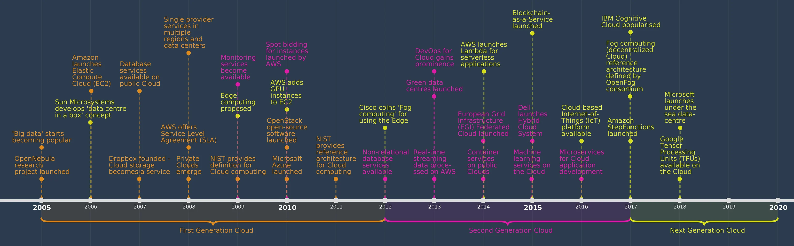
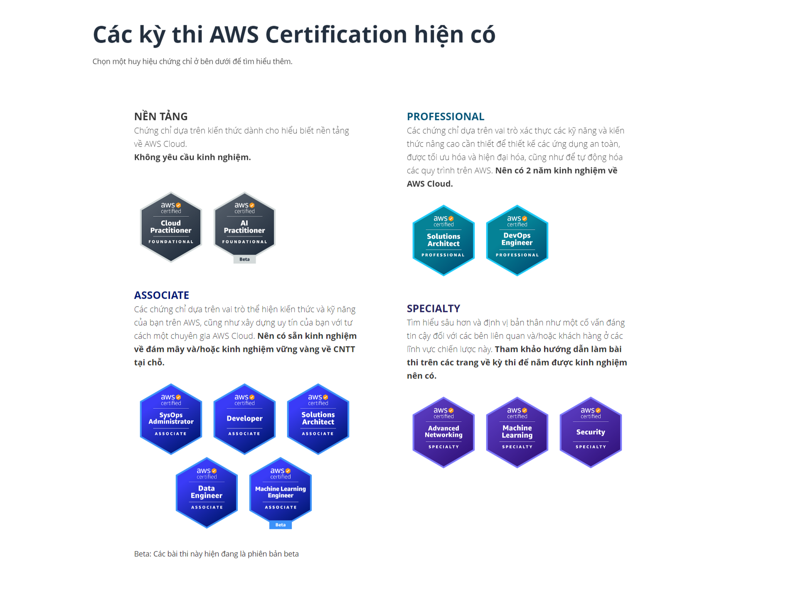

# Khai quát cloud
## Phân biệt các loại cloud
* On premise: Là hệ thống vận hành trên nền tảng phần cứng và mạng nội bộ công ty, doanh nghiệp
* Public cloud: là dịch vụ máy cloud được cung cấp từ cloud provider (AWS, Azure, GCP)
* Private cloud: là dịch vụ cloud chỉ dành riêng cho công ty, doanh nghiệp, tài nguyên chỉ available cho người dùng được uỷ quyền. Mô hình này giá thành cao hơn public cloud.
* Hybrid cloud: kết hợp public cloud với private cloud (or on premise). Tổ chức sử dụng public cloud để phục vụ nhu cầu động và private cloud cho quản trị.
* Muilti cloud: Sự kết hơn nhiều hơn 1 provider cloud để khai thác thể mạnh tối đa của các provider (Dùng cả AWS, Azure, GCP)
## Phân biệt IaaS, PaaS, Saas
**Infrastructure as a Service (IaaS)** - Cơ sở hạ tầng như dịch vụ: Cung cấp cái tài nguyên (Server, Storage, Networking, Security) về máy chủ để KH tự quản lý và sử dụng. **(EC2, S3, VPC)**

**Platform as a Service (PaaS)** - Nền tảng dịch vụ: Cung cấp môi trường thực thi ứng dụng đầy đủ, bao gồm các dịch vụ phát triển ứng dụng, csdl và network system **(Elastic Beanstalk, Lambda)**

**Software as a Service (SaaS)** - Phần mềm dưới dạng dịch vụ: cung cấp các ứng dụng được phát triển sẵn và KH chỉ cần sử dụng bằng giao diện ứng dụng mà không cần quan tâm đến quản lý, bảo trì. **(Simple Email Service (SES), Amazon WorkMail, Google Workspace, Microsoft Office 365, Salesforce CRM, Jira)**

## So sánh Cloud Provider và Host Service (Dịch vụ cung cấp host ngày xưa)
| Tiêu chí so sánh| CloudProvider | Hosting Service |
| -------- | ------- | ------- |
| Pricing model   | $On-demand. Bạn chỉ trả tiền cho những gì mình sử dụng. Không cần cam kết trả trước.    | Cần hợp đồng thuê trước server theo cấu hình. VD: 1 server 2 CPU, 2GB RAM 3 tháng |
| Linh hoạt trong cấu hình | Thay đổi cấu hình tài nguyên một cách dễ dàng và nhanh chóng.     | Cần sử can thiệp từ bên cung cấp hosting, có thể cần sửa contract |
| Khả năng scale     | Dễ dàng tăng/giảm số lượng tài nguyên khi cần để đáp ứng nhu cầu workload.    | Khó khăn khi thay đổi theo nhu cầu |
| Số lượng các dịch vụ Đ     | Đa dạng    | Hạn chế chỉ cung cấp dịch vụ cơ bản như Virtual server Database, Storage, Firewall. |

## Lịch sử phát triển của aws

https://www.bcs.org/articles-opinion-and-research/history-of-the-cloud/

## Hệ thống chứng chỉ AWS

## Định nghĩa và giới thiệu dịch vụ
### Region
> Là những khu vực vật lý trên thế giới độc lập nơi mà Amazon đặt cơ sở hạ tầng để cung cấp dịch vụ cloud.

Mỗi region sẽ bao gồm nhiều Availability Zone (AZ).

**Việc lựa chọn region phụ thuộc**
* Tuân thủ tiêu chuẩn, pháp luật nơi triển khai sử dụng
* Nơi tập trung users được phục vụ
* Giá cả dịch (mỗi region có thể có giá khác nhau có chi phí cơ sở hạ tầng khác nhau)

Lưu ý:
> Một số region không available by-default, cần enable để có thể sử dụng. AWS có mặt tại China nhưng không thể trực tiếp switch sang region này trên Console. Cần phải đăng ký với AWS một account riêng biệt và tách biệt hoàn toàn với các account thông thường.

### Availability Zone
> Một Availability Zone (AZ) là một trung tâm dữ liệu hoặc một nhóm các trung tâm dữ liệu nằm trong cùng một khu vực vật lý, nhưng được phân bổ và vận hành hoàn toàn độc lập. Mỗi AZ có thể có các tài nguyên đám mây như máy chủ ảo, ổ cứng, network, security, các dịch vụ khác nhau, cùng với các tài nguyên hỗ trợ khác như hệ thống cấp điện. Việc sử dụng nhiều Availability Zone giúp đảm bảo tính khả dụng (HA) cao cho ứng dụng, tăng tính bảo mật và bảo đảm dữ liệu được lưu trữ và xử lý an toàn. Nếu một AZ bị sự cố hoặc ngừng hoạt động, các tài nguyên đám mây được triển khai tại các AZ khác vẫn có thể hoạt động bình thường, giúp đảm bảo rằng dịch vụ của bạn vẫn hoạt động một cách liên tục và đáng tin cậy.

Mỗi region có >= 3AZ
Hầu hết service đều có thể triển khai muilti AZ

**Local zone**
> Là loại infrastructure deployment cung cấp các dịch vụ mà gần với vị trí chính xác của tập end user hơn.

Ví dụ chọn Region Singape thì có thể bật local zone ở Thái Lan để dành cho end user.

### Edge location
> Là tập hợp các điểm phân phối (point of present) như CloudFront, Route 53. MỗI Edge location như trung tâm dữ liệu nhỏ hoạt động như bộ đệm trung gian làm giảm độ trễ và tăng tốc độ truy cấp cho end user khi thực hiện.

Số lượng edge location > số lượng region

### Các dịnh vụ phổ biến conputing & contaniner
* Amazon Elastic Compute Cloud (Amazon EC2)
* AWS Elastic Beanstalk
* AWS Lambda Amazon EC2
* Auto Scaling
* Amazon Elastic Container Registry (Amazon ECR)
* Amazon Elastic Container Service (Amazon ECS)
* Amazon Elastic Kubernetes Service (Amazon EKS)
* AWS Fargate
* AWS Outposts family

### Các dịnh vụ phổ biến Storage
* Amazon Elastic Block Store (Amazon EBS)
* Amazon Simple Storage Service (Amazon S3)
* Amazon Elastic File System (Amazon EFS)
* AWS Storage Gateway
* Amazon FSx for Lustre
* Amazon FSx
* Amazon FSx for Windows File Server
* AWS Snowmobile 
* AWS Snowball
* CloudEndure Disaster Recovery
* AWS Backup

### Các dịnh vụ phổ biến networking
* Amazon Virtual Private Cloud (Amazon VPC)
* Amazon CloudFront
* AWS Cloud Map
* AWS Client VPN
* AWS Transit Gateway
* AWS PrivateLink
* Amazon Route 53
* Elastic Load Balancing 
* AWS Site-to-Site VPN
* AWS Global Accelerator 
* AWS Direct Connect

### Các dịnh vụ phổ biến Database
* Amazon Aurora
* Amazon ElastiCache
* Amazon DynamoDB
* Amazon Relational Database Service (Amazon RDS)
* Amazon DocumentDB (with MongoDB compatibility)
* Amazon MemoryDB for Redis
* Amazon Neptune 
* Amazon Quantum Ledger Database (Amazon QLDB)
* Amazon Keyspaces (for Apache Cassandra)

### Các dịnh vụ phổ biến Security & Identity
* AWS Identity and Access Management (IAM)
* AWS Key Management Service (AWS KMS)
* AWS Secrets Manager
* Amazon Cognito
* AWS WAF
* AWS Certificate Manager (ACM)
* AWS Firewall Manager
* Amazon GuardDuty 
* AWS Artifact 
* AWS Shield
* Amazon Inspector
* Amazon Macie
* AWS Directory Service
* Amazon Cloud Directory
* AWS CloudHSM

### Các dịnh vụ phổ biến Management & Governance
* AWS Config
* AWS Management Console
* AWS CloudTrail
* AWS Control Tower
* AWS Systems Manager
* AWS Trusted Advisor
* AWS Organizations
* AWS CloudFormation
* AWS Budgets
* AWS Cost Explorer
* AWS Cost & Usage Report
* AWS Resource Explorer
* AWS OpsWorks
* AWS Well-Architected Tool

### Các dịnh vụ phổ biến Monitoring
* Amazon CloudWatch 
* AWS CloudTrail

### Các dịnh vụ phổ biến Messaging, Application integration
* Amazon Simple Email Service (Amazon SES)
* Amazon Simple Notification Service (Amazon SNS)
* Amazon Simple Queue Service (Amazon SQS)
* Amazon MQ 
* AWS AppSync
* Amazon EventBridge 
* Amazon API Gateway
### Các dịnh vụ phổ biến Deployment & Automation
* AWS Cloud9 
* AWS CodeBuild 
* AWS CodeCommit 
* AWS CodeDeploy CICD
* AWS CodePipeline
* AWS X-Ray 
* AWS Cloud Development Kit (AWS CDK)
* AWS CodeArtifact 
* AWS CloudShell

### Các dịnh vụ phổ biến Migration
* AWS Database Migration Service (AWS DMS)
* AWS Server Migration Service (AWS SMS)
* AWS Application Discovery Service
* AWS Transfer Family 
* AWS DataSync
* AWS Migration Hub
* AWS Application Migration Service
* AWS Migration Evaluator 
* AWS Mainframe Modernization

### Các dịnh vụ phổ biến Big data & Data analytic
* Amazon Redshift 
* Amazon QuickSight 
* AWS Lake Formation 
* AWS Data Pipeline
* Amazon Managed Streaming for Apache Kafka
* AWS Data Exchange
* AWS Glue DataBrew
* Amazon FinSpace
### Các dịnh vụ phổ biến AI & Machine learning
* Amazon Polly 
* Amazon Rekognition 
* Amazon SageMaker 
* Amazon Translate
* AWS Deep Learning AMIs
* AWS Deep Learning Containers
* AWS DeepLens 
* AWS DeepRacer
* TensorFlow on AWS
* AWS DeepComposer
* Amazon Fraud Detector 
* Amazon Kendra 
* Amazon CodeGuru

### Các dịnh vụ phổ biến Management & Governance

## EC2 Amazon Elastic Compute Cloud
> Là máy ảo chạy trên hypervisor, bên dưới là các phần cứng AWS và người dùng quản lý tầng OS trở lên.

AMI: Amazon machin image là file ISO/Ghost chứa hệ điều hành khởi động lên ec2

EBS Volume: ổ cứng dụng lượng được gắn vào ec2

Amazon cung cấp cơ chế snapshot volume. Size snapshot = size volume (15GB, 30GB,...)

Các Thao tác với ec2
* Launch instance
* Reboot instance
* Stop instance
* Start instance
* Terminate instance
* Attach/Detach volume
* Attach/Detach IP
* Attach/Detach security group
* Attach/Detach IAM role
* Create snapshot from volume
* Create Amazon machin image (AMI) from ec2 instance

**Security group**
Giới hạn đi ra đi vào ec2
Inbound rule: Check đi vào
Outbound rule: Check đi ra (all là default)
Rule chỉ có allow chứ không có deny (chỉ có allow hay không)
