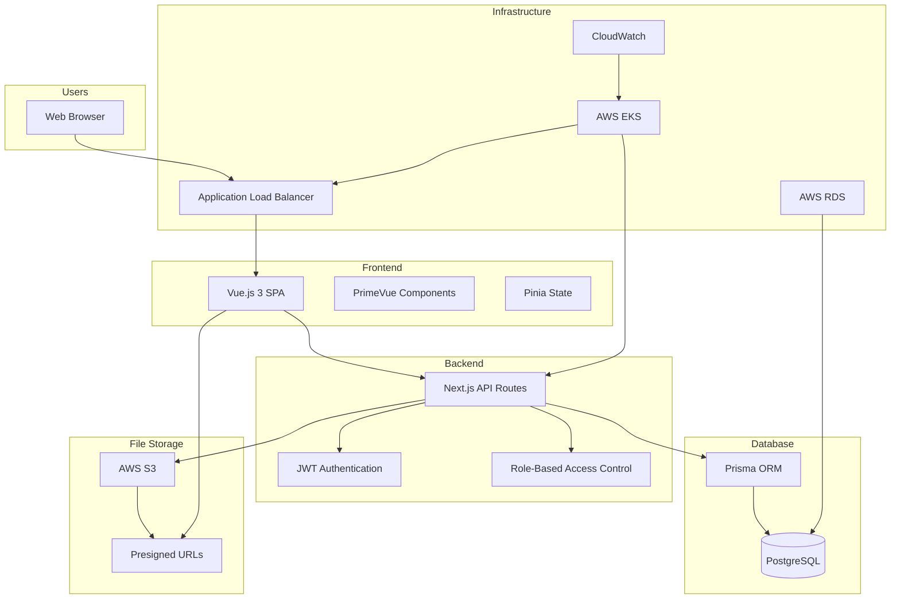

# High Level Architecture

## Technical Summary

The AI Knowledge Portal will be built as a **modern full-stack web application** using a **monolithic backend architecture** with Next.js API routes and a **single-page application (SPA) frontend** with Vue.js 3. The system will be deployed on **AWS infrastructure** using **Docker containerization** and **Kubernetes orchestration** for scalability and maintainability.

**Key Integration Points**: The frontend will communicate with the backend through **RESTful API endpoints**, with **JWT-based authentication** and **role-based access control**. File storage will be handled through **AWS S3 integration** with presigned URLs for secure access.

**Infrastructure Platform**: AWS with EKS for container orchestration, RDS for PostgreSQL database, S3 for file storage, and ALB for load balancing. This architecture achieves the PRD goals by providing a scalable, secure, and maintainable platform for internal AI knowledge sharing.

## Platform and Infrastructure Choice

**Platform:** AWS Full Stack  
**Key Services:** EKS, RDS, S3, ALB, CloudWatch  
**Deployment Host and Regions:** AWS EKS, Multi-region capable  

## Repository Structure

**Structure:** Monorepo  
**Monorepo Tool:** npm workspaces (lightweight, no additional tooling required)  
**Package Organization:** apps/ for applications, packages/ for shared code  

## High Level Architecture Diagram

## Architectural Patterns

- **Monolithic Backend Architecture:** Next.js API routes for all backend functionality - *Rationale:* Simplifies development and deployment for the team size, provides good performance for the expected load
- **Component-Based Frontend:** Vue.js 3 components with PrimeVue library - *Rationale:* Enables reusable UI components, maintains consistency, and supports the responsive design requirements
- **Repository Pattern:** Prisma ORM for data access abstraction - *Rationale:* Provides type-safe database operations and enables easy testing and future migrations
- **JWT Authentication Pattern:** Token-based authentication with role-based access control - *Rationale:* Stateless authentication suitable for containerized deployment, supports the admin/user role requirements
- **API Gateway Pattern:** Next.js API routes as single entry point - *Rationale:* Centralized authentication, rate limiting, and monitoring for all API calls 