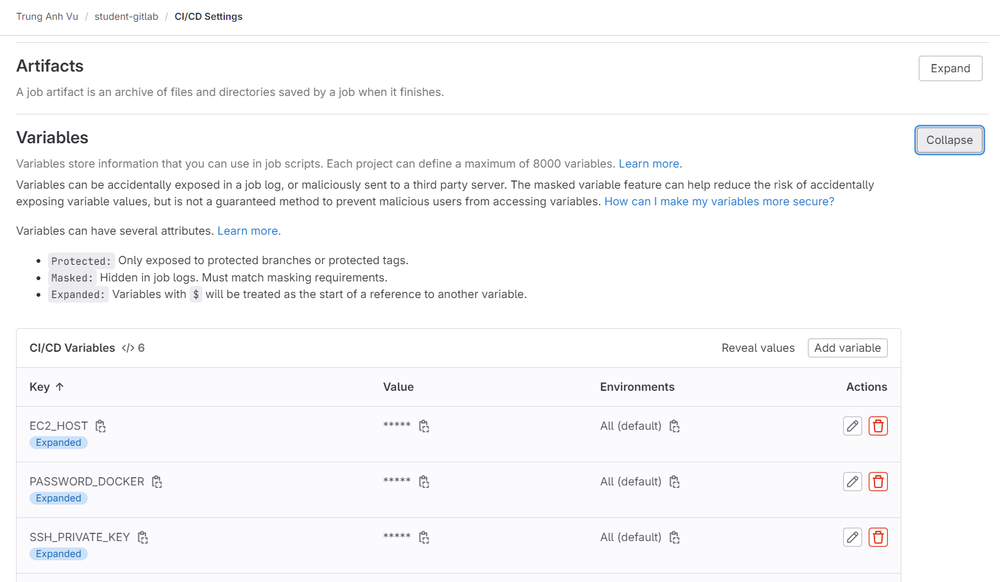

Gitlab runner trigger theo cài đặt trong file gitlab-ci.yml mỗi khi commit.
Trigger với từng push branch, merge request
Trong quá trình sử dụng các variable khai báo trong gitlab CICD

Yêu cầu:
* Định nghĩa các biến trong gitlab CICD (account docker, ec2 server, token,...)
* Dockerfile chạy thành công dưới local
* Chỉ định rõ version của image chính trong gitlab-ci.yml

Flow:
> Local 
> push code
> Gitlab runner trigger
> Pipeline, stages, jobs chạy
> Gitlab runner install image, service trong file yml 
> Run before script
> Chạy tuần tự từng stage (maven build, test, build docker và push lên docker registru, gitlab registry)
> Thực hiện deploy (connect vào server, cài đặt docker, login docker, pull docker registry, run container) - TODO

```shell
image: docker:20.10.16
services:
  - docker:dind

variables:
  IMAGE_NAME: vutrunganhworkit/student-gitlab

before_script:
  - chmod +x mvnw
  - export MAVEN_USER_HOME=`pwd`/.maven

stages:
  - build
  - test
  - docker
  - deploy

maven-build:
  image: maven:3.8.1-openjdk-17-slim
  stage: build
  script: "./mvnw clean package"
  artifacts:
    paths:
      - target/*.jar

maven-test:
  image: maven:3.8.1-openjdk-17-slim
  stage: test
  script: "mvn test"
  artifacts:
    paths:
      - target/*.jar

docker-build:
  stage: docker
  script:
    - docker --version
    - SHORT_TAG="${CI_COMMIT_SHORT_SHA}"
    - TAG="${CI_COMMIT_SHA}"
    - echo $PASSWORD_DOCKER |  docker login -u $USERNAME_DOCKER --password-stdin
    - docker login -u $USERNAME_DOCKER -p $PASSWORD_DOCKER
    - docker build -t $IMAGE_NAME:$SHORT_TAG .
    - docker push $IMAGE_NAME:$SHORT_TAG
    - docker login registry.gitlab.com -u $user -p $token_password
    - docker build -t registry.gitlab.com/vutrunganh1/student-gitlab:$TAG .
    - docker push registry.gitlab.com/vutrunganh1/student-gitlab:$TAG
  only:
    - main
    - staging

deploy:
  stage: deploy
  image: docker:25.0.5
  script:
    - TAG="${CI_COMMIT_SHA}"
    - apt-get update -qq && apt-get install -qqy openssh-client
    - mkdir -p ~/.ssh
    - echo "$SSH_PRIVATE_KEY" | tr -d '\r' > ~/.ssh/id_rsa
    - chmod 600 ~/.ssh/id_rsa
    - ssh-keyscan -H $EC2_HOST >> ~/.ssh/known_hosts
    - ssh ec2-user@$EC2_HOST "
      sudo apt-get update
      sudo apt-get install ca-certificates curl
      sudo install -m 0755 -d /etc/apt/keyrings
      sudo curl -fsSL https://download.docker.com/linux/ubuntu/gpg -o /etc/apt/keyrings/docker.asc
      echo \
      "deb [arch=$(dpkg --print-architecture) signed-by=/etc/apt/keyrings/docker.asc] https://download.docker.com/linux/ubuntu \
      $(. /etc/os-release && echo "$VERSION_CODENAME") stable" | \
      sudo tee /etc/apt/sources.list.d/docker.list > /dev/null
      sudo apt-get update
      sudo apt-get install docker-ce docker-ce-cli containerd.io docker-buildx-plugin docker-compose-plugin
      sudo docker login registry.gitlab.com -u $user -p $token_password;
      sudo docker pull registry.gitlab.com/vutrunganh1/student-gitlab:$TAG;
      sudo docker stop student-gitlab || true;
      sudo docker rm student-gitlab || true;
      sudo docker run -d --name student-gitlab -p 8080:8080 registry.gitlab.com/vutrunganh1/student-gitlab:$TAG;
      "
  only:
    - main
```


Màn hình định nghĩa variables
.

