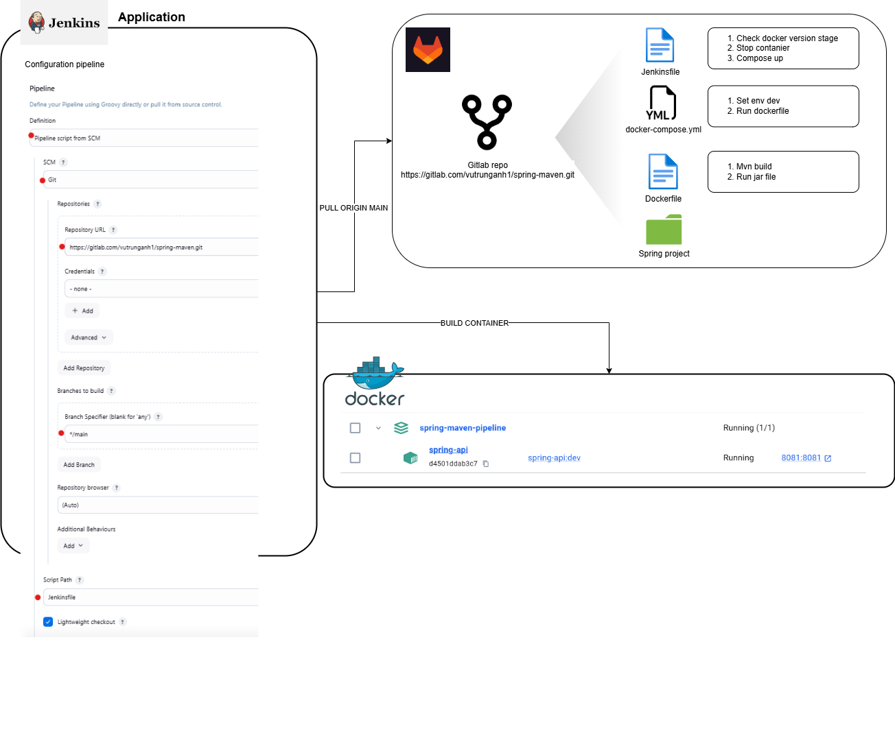
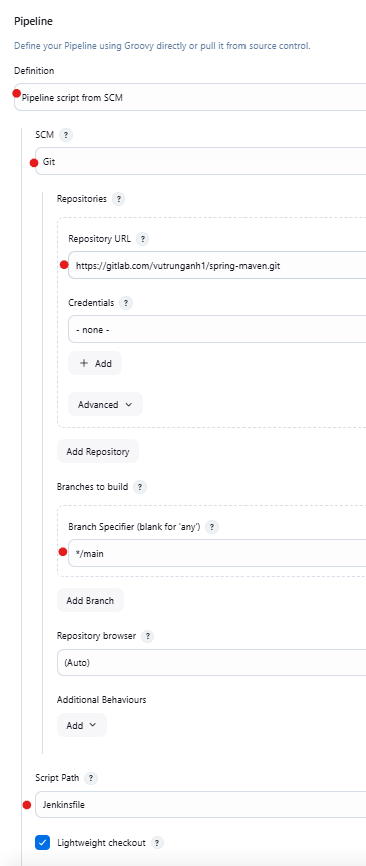

# Jenkins + Spring boot 3(Docker + Maven)


# Setup docker + compose
## Dockerfile
```dockerfile
# First stage: build the Java application
FROM maven:3.9.9-amazoncorretto-17-alpine AS build
WORKDIR /app
COPY pom.xml .
RUN mvn dependency:go-offline
COPY src/ src/
RUN mvn package

# Second stage: copy the built app from the first stage
FROM amazoncorretto:17-alpine3.18
WORKDIR /app
COPY --from=build /app/target/*.jar java-api.jar

# Default spring port or configuration port in resources
EXPOSE 8081
CMD ["java", "-jar", "java-api.jar"]
```

## docker-compose.yml
```yml
version: '3.9'

services:
  spring-api:
    container_name: spring-api
    image: spring-api:dev
    build:
      context: .
      dockerfile: Dockerfile
    ports:
      - '8081:8081'
    environment:
      - SPRING_PROFILES_ACTIVE=dev
    restart: unless-stopped
```

# Pipeline
## Jenkinsfile
```jenkinsfile
pipeline {
    agent any  // Chạy trên bất kỳ node nào

    environment {
        IMAGE_NAME = "spring-maven-app"
        CONTAINER_NAME = "spring-maven-container"
        DOCKER_COMPOSE_PATH = "$WORKSPACE/docker-compose.yml"
    }

    stages {
		stage('Check Docker Version') {
            steps {
                bat 'docker --version'
            }
        }
		stage('Down containers') {
            steps {
                bat "docker-compose -f ${DOCKER_COMPOSE_PATH} down"
            }
        }
        stage('Run with Docker Compose') {
            steps {
                bat "docker-compose -f ${DOCKER_COMPOSE_PATH} up -d --build"
            }
        }
    }

    post {
        always {
            echo "Pipeline finished"
        }
    }
}
```

## Configuration pipeline in jenkins


P/s: Jenkins + Spring + Maven: https://howtodoinjava.com/devops/setup-jenkins-pipeline-for-spring-boot-app/