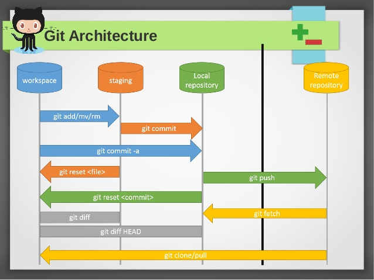

# Git ALL

## 1. Git flow


* Workspace: workspace/working directory đề cập đến khu vực của dự án nơi bạn đang làm việc. Nó chứa tất cả các tệp và thư mục của dự án mà bạn đang phát triển
* Staging/Index: là một khu vực trung gian nơi bạn có thể sắp xếp các thay đổi mà bạn muốn cam kết (commit) vào lịch sử của dự án.
* Local repository: Kho chứa cục bộ là nơi lưu trữ lịch sử đầy đủ của tất cả các thay đổi và các bản commit trong dự án.
* Remote repository: là một phiên bản của dự án được lưu trữ trên máy chủ hoặc dịch vụ từ xa (như GitHub, GitLab, Bitbucket, v.v.), giúp cho nhiều người có thể cộng tác và chia sẻ mã nguồn từ các địa điểm khác nhau

**Flow:**
>[Workspace] --> git add --> [Staging Area] --> git commit --> [Local Repository] --> git push --> [Remote Repository]

## 2. Git Remote repository
### 2.1. Git clone
>Lệnh này tạo một bản sao của toàn bộ kho chứa từ xa vào disk máy tính, **bao gồm toàn bộ lịch sử commit**.

```sh
git clone https://github.com/user/repository.git
```

### 2.2. Git fetch
>Lệnh git fetch sẽ lấy **tất cả các thay đổi mới** từ remote repository về máy tính của bạn, nhưng **không hợp nhất (merge) chúng vào nhánh hiện tại**. Tạo và cập nhật **các tham chiếu địa phương (local references)** cho các nhánh remote, điều này cho phép bạn kiểm tra các thay đổi từ xa trước khi áp dụng chúng vào dự án của mình.

* Fetch tất cả branch + tất cả remote alias
```sh
git fetch
```

* Fetch tất cả branch trong origin remote alias
```sh
git fetch origin
```

* Fetch branch main trong origin remote alias
```sh
git fetch origin main
```


### 2.3. Git pull
>lệnh git pull kết hợp hai bước: **fetch và merge**. Nó lấy các thay đổi từ remote repository và hợp nhất chúng vào nhánh hiện tại của bạn. Đây là cách thường dùng để cập nhật nhánh của bạn với các thay đổi mới nhất từ remote repository.
* Fetch tất cả branch + tất cả remote alias + Merge **branch remote tương ứng** vào **branch local tương ứng** 
```sh
git pull
```

* Fetch tất cả branch trong origin remote alias + Merge **branch remote tương ứng** vào **branch local tương ứng** 
```sh
git pull origin
```

* Fetch branch main trong remote alias + Merge branch **main remote** vào **branch hiện tại** ở local. Ví dụ đang ở develop thực hiện lệch này sẽ merge ở main remote vào local develop
```sh
git pull origin main
```

### 2.4. Git remote
>Là lệch để quản lý và thao tác với remote repository. **origin là alias mặc định** của remote repository khi clone.
List alias
```sh
git remote -v
```

Add alias
```sh
git remote add gitlab https://gitlab.com/user/repository.git
```

Đổi tên alias
```sh
git remote rename origin github
```

Xoá alias
```sh
git remote remove gitlab
```

**Thao tác 1 local repository với nhiều remote repository (ví dụ github và gitlab)**
>clone -> add new remote alias -> push to new alias

* Step1: Chuẩn bị local repository từ đầu hoặc sử dụng từ github/gitlab
```sh
git clone https://github.com/user/repository.git
```
* Step2: Tạo mới alias cho gitlab (tiền đề cần repo trên gitlab.com)
```sh
git remote add gitlab https://gitlab.com/user/repository.git
```

* Step3: Push code lên remote repository khác (nếu không branch main được protected thì cần tạo branch mới và pull request)
```sh
git push gitlab
```


## 3. Git Local repository
### 3.1. Git init
>Khởi tạo một repository Git mới hoặc chuyển một thư mục hiện có thành một repository Git. Tạo ra folder .git. Git init không tự động tạo .gitignore 
```sh
git init
```
### 3.2. Git add
>Thêm các thay đổi từ working directory vào staging area/index để chuẩn bị cho commit.
```sh
git add <file_path>
```

Add tất cả các file
```sh
git add .
```

Add các file chỉ định
```sh
git add folder1/ folder2/file1.txt
```

Add các file chỉ thay đổi
```sh
git add -u
```

Add các file chưa được theo dõi
```sh
git add -A
```

### 3.3. Git commit
>Lưu trạng thái hiện tại của staging area vào local repository với một message commit.

Commit không có nội dung
```sh
git commit
```

Commit có nội dung
```sh
git commit -m "Nội dung commit"
```

Sửa commit cuốI cùng (amend)
```sh
git commit --amend -m "Updated commit message"
```

### 3.4. Git status
>Hiển thị trạng thái của working directory và staging area.

```sh
git status
```

Check status của nhánh
```sh
git status -b
```

### 3.5. Git log
>Hiển thị lịch sử các commit trên nhánh hiện tại.

```sh
git log
```

Hiển thị chỉ một số commit
```sh
git log -3
```

Hiển thị thông tin cụ thể
```sh
git log --stat
```

Hiển thị commit log ngắn gọn
```sh
git log --oneline
```

Hiển thị lịch sử commit đồ thị
```sh
git log --graph
```

Hiển thị commit chỉ từ một tác giả cụ thể
```sh
git log --author="trunganhvu"
```

Hiển thị commit chỉ từ một thời gian cụ thể
```sh
git log --since="2023-01-01"
```

Hiển thị chi tiết về các thay đổi của từng commit (lên, xuống, q để thoát)
```sh
git log -p
```

### 3.6. Git branch
>Thao tác các branches hiện có trong repository local.

Hiển thị các branch ở local
```sh
git branch
```

Hiển thị các branch ở remote
```sh
git branch -r
```

Hiển thị các branch ở remote + local
```sh
git branch -a
```

Hiển thị các branch ở đã merge/chưa merge
```sh
git branch --merge

git branch --no-merge
```

Tạo branch + **không** chuyển sang branch mới
```sh
git branch <new branch>
```

Chuyển sang branch mới
```sh
git switch <branch>
```

Tạo + Chuyển sang branch mới
```sh
git switch -c <branch>
```

Xoá branch đã merge (an toàn)
```sh
git branch -d <branch>
```

Xoá branch bất kể đã merge hay chưa merge (mạnh nhưng rủi ro mất branch)
```sh
git branch -D <branch>
```


### 3.7. Git checkout
>Đặt lại HEAD tới một commit cụ thể và chuyển các thay đổi từ staging area trở về working directory.

Chuyển đổi branch
```sh
git checkout <branch_name>
```

Tạo branch mới
```sh
git checkout -b <branch_name>
```

Checkout tới commit cụ thể
```sh
git checkout <commit-hash>

git checkout <commit-hash> -- <file-path>
```

### 3.8. Git reset
>Đặt lại HEAD tới một commit cụ thể và chuyển các thay đổi từ staging area trở về working directory. Có ba chế độ chính của git reset là --soft, --mixed (mặc định nếu không có tùy chọn nào được chỉ định), và --hard

```sh
git reset <commit_hash>
```

* git reset --soft: Di chuyển HEAD đến một commit cụ thể mà không làm thay đổi index và working directory. Các thay đổi từ commit mới đến commit cũ sẽ được đưa vào staging area để bạn có thể thực hiện lại commit với nội dung mới. **Reset về trạng thái commit chỉ định, Đưa toàn bộ trạng thái đã commit về dạng add**
```sh
git reset --soft <commit>
git reset --soft HEAD~3
```

* git reset --mixed (mặc định): Di chuyển HEAD đến một commit cụ thể và đặt lại index (staging area) để phản ánh trạng thái của commit đó. Các thay đổi trong index được xóa đi, nhưng vẫn giữ lại các thay đổi trong working directory. **Reset về trạng thái commit chỉ định, nội dung được add và chưa commit bị xoá, giữ nguyên working directory**
```sh
git reset --mixed <commit>
git reset --mixed <commit>
```

* git reset --hard: Di chuyển HEAD đến một commit cụ thể và thay đổi index (staging area) và working directory sao cho chúng giống với trạng thái của commit đó. Mọi thay đổi chưa được commit sẽ bị mất mát. **Reset về trạng thái commit chỉ định, những nôi dung chưa commit đều mất**
```sh
git reset --hard <commit>
git reset --hard HEAD~1
```


### 3.9. Git revert
>Tạo một commit mới để đảo ngược một commit đã tồn tại trước đó. Khác với git reset, **git revert tạo ra một commit mới để đảo ngược các thay đổi của commit trước đó**. Điều này giữ cho lịch sử của repository rõ ràng và dễ theo dõi, đặc biệt hữu ích trong các môi trường làm việc cộng tác

```sh
git revert <commit_hash1> <commit_hash2..>
```

Lịch sử commit **trước**
```sh
a1b2c3d - Commit 3
e4f5g6h - Commit 2
i7j8k9l - Commit 1
```

Thực hiện **revert commit số 2**
```sh
git revert e4f5g6h
```

Lịch sử commit **sau khi revert commit 2**
```sh
m1n2o3p - Revert "Commit 2"
a1b2c3d - Commit 3
e4f5g6h - Commit 2
i7j8k9l - Commit 1
```

Revert commit nhưng không thực hiện commit luôn để chỉnh sửa thêm
```sh
git revert -n <commit>
```

Việc revert commit merge thì có thể chỉ định parent
```sh
*   merge-commit (M)
|\
| \
|  * commit-on-feature (F) parent 2
| /
|/
* commit-on-main (P) - parent 1
```

Revert giữ lại parent 1/2
```sh
git revert -m 1 merge-commit
git revert -m 2 merge-commit
```


### 3.10. Git merge
>Hợp nhất các thay đổi từ một branch vào branch hiện tại. Có hai loại merge chính trong Git:<br>
1.Fast-forward merge<br>
2.Three-way merge

Merge nhánh chỉ định vào nhánh đang đứng với -m message(optional)
```sh
git merge -m "Merging feature branch" <branch_name> 
```

**Fast-forward merge**
```sh
A---B---C (main)
         \
          D---E (feature)
```

Graph sau merge
```sh
A---B---C---D---E (main, feature)
```

**Three-way merge**
```sh
A---B---C (main)
 \      \
  D---E---F (feature)
```

Graph sau merge
```sh
A---B---C-------G (main)
 \      \     /
  D---E---F (feature)
```

Tạo một merge commit ngay cả khi có thể thực hiện fast-forward. Điều này giúp giữ lại lịch sử của merge.
```sh
git merge --no-ff feature
```

Gộp tất cả các thay đổi từ branch được merge vào một commit duy nhất trên branch hiện tại. Commit này không lưu lại thông tin về merge.
```sh
git merge --squash feature 
```

Thực hiện commit ngay sau khi merge (đây là hành vi mặc định trừ khi sử dụng --no-commit).
```sh
git merge --commit feature
```

Thực hiện merge mà không tạo commit ngay lập tức, cho phép bạn xem xét và sửa đổi các thay đổi trước khi commit.    
```sh
git merge --no-commit feature
```

Giải quyết conflict
File conflict sẽ có các đánh dấu
```sh
<<<<<<< HEAD
Your changes on current branch
=======
Their changes on merge branch
>>>>>>> branch-to-merge
```

Cách giải quyết:

Xoá ký tự đánh dấu > Chỉnh sửa nội dung cho phù hợp > Add và commit merge

### 3.11. Git stash
>Là một công cụ mạnh mẽ giúp bạn tạm thời lưu lại các thay đổi chưa được commit trong working directory và staging area, để bạn có thể chuyển sang một nhánh khác, thực hiện một công việc khác, hoặc pull các thay đổi từ remote repository mà không bị gián đoạn bởi các thay đổi chưa hoàn thành.
<br>Các thay đổi tạm thời sẽ được lưu trữ trong một phần đặc biệt của cấu trúc Git được gọi là "refs" (references). Cụ thể hơn, chúng được lưu trong một ref có tên là refs/stash. **Git stash thực hiện lưu tất cả các file chưa được commit**

Hiển thị danh sách tất cả các stash hiện có.
```sh
git stash list
```

Hiển thị nội dung stash trong file
```sh
git stash show -p stash@{0}
```

Stash các thay đổi hiện tại:
```sh
-- Chỉ stash các file sửa (update nội dung)
git stash

git stash save "My work in progress"

-- push --keep-index (or use -k): Chỉ stash các file đc add (chưa lưu ở staging/index)
git stash push --keep-index

-- push --include-untracked (or use -u): Stash tất cả file (mới + sửa)
git stash push --include-untracked
```

Áp dụng lại stash đã lưu vào workspace hiện tại:
```sh
-- apply + không xoá trong stash
git stash apply
git stash apply stash@{0}

-- apply + xoá trong stash
git stash pop
git stash pop stash@{0}
```

Xoá và clear toàn bộ stash
```sh
git stash clear

git stash drop stash@{1}
```
### 3.12. Git restore
>Khôi phục các file chưa add về ban đầu.
>Bỏ add và đưa thay đổi về working directory.
>Khôi phục về file trong 1 commit cụ thể

Phục hồi tất cả file
```sh
git restore .
```

Khôi phục các file đã sửa + chưa add vào staged về ban đầu
```sh
git restore <file>...
```

Khôi phục các file đã add vào staged về working directory
```sh
git restore --stage <file>...
```

Khôi phục files/folder về trạng thái trong 1 commit
```sh
git restore --source <commit> src/ 
git restore --source <commit> test.txt
```

### 3.13. Git reflog
>Theo dõi tất cả các tham chiếu tới working directory. Khi reset, amend commit git log sẽ không thấy được nhưng git reflog thấy được.

Show all log
```sh
git reflog
```

xem reflog của một nhánh cụ thể:
```sh
git reflog show develop
```

Show n log
```sh
git reflog -n 10
```

Show log theo thời gian
```sh
git reflog --since="1 day ago"
git reflog --since="2 days ago"
git reflog --since="24 hoursgit reflog | grep commit
 ago"
```

Grep log
```sh
git reflog --grep-reflog <pattern_key>
git reflog --grep-reflog fix/implement
```

### 3.14. Git cherry pick
>áp dụng một hoặc nhiều commit từ một nhánh này sang một nhánh khác

Thực hiện bê commit_a (feature_a) sang feature_b (nhánh hiện tại)
```sh
git cherry-pick commit_a
```

Trường hợp cherry pick có conflict thì 
* Cách 1: Resolve bằng text editor và cherry pick continues
* Cách 2: Stash các file thay đổi rồi thực hiện cherry pick

Cách 1:
```sh
-- 1.Resolve conflict
-- 2.Tiếp tục cherry pick
git cherry-pick --continue
```

Cách 2:
```sh
git stash
git cherry-pick <commit>
```

Lệch cancel cherry pick
```sh
git cherry-pick --abort
```

Cherry pick với edit message
```sh
git cherry-pick -e <commit-hash>
```

Cherry pick nhiều commit liền nhau (các commit không liền nhau phải **pick từ cái 1**)
```sh
git cherry-pick <commit1>..<commitN>
```


### 3.15. Git rebase
>Thực hiện base lại nhánh hiện tại bằng nhánh khác trên local

Thực hiện rebase main ở develop: <br>
1.checkout main > 2.pull origin main > 3.checkout develop > 4.pull origin develop > 5.rebase > 6.force push
```sh
git checkout main

git fetch origin main

git pull origin main

git checkout develop

git fetch origin develop

git pull origin develop

git rebase main

git push origin develop -f
```

Trường hợp có conflict thực hiện resolve hoặc stash. Rồi tiếp tục rebase
```sh
git rebase --continue
```

Huỷ bỏ rebase
```sh
git rebase --abort
```

### 3.16. Git force
>Là lệch ép buộc thực thi. Có hiệu lực với reset, push (chỉ dùng khi rebase), checkout, xoá branch

Force với reset
```sh
git reset --hard HEAD
```

Force với push sử dụng khi rebase
```sh
git push origin <branch-name> --force
git push origin <branch-name> -f
```

Force với xoá branch
```sh
git branch -D <branch-name>
```

Force với checkout nhánh mới và đưa code về trạng thái ban đầu
```sh
git checkout -f
git checkout --force
```

### 3.17. Git blame
> Lệch check history từng line code trong file cụ thể

Check blame cho từng dòng
```sh
 git blame git.md
```

Output theo template
```sh
<ID><Author><Date><Time><Line number><Content>     

4dc13941 (Trung Anh 2024-06-13 18:30:09 +0700   3) ## 1. Git flow
```