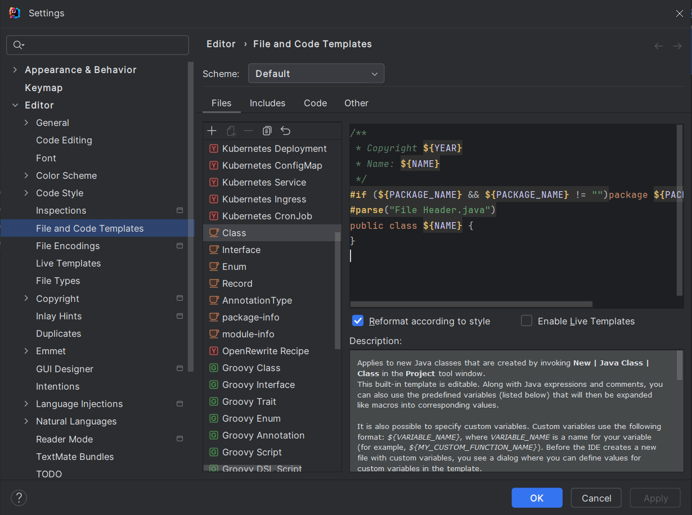
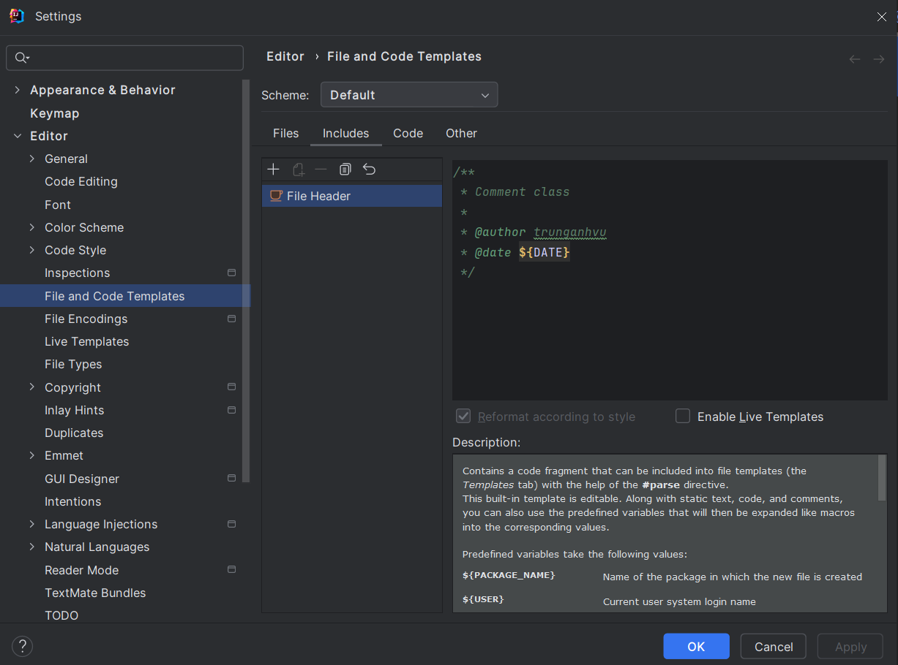

# Setup trên IntelliJ IDEA

Comment đầu file


Comment đầu class


# Template comment đầu file

Cách 1: Copyright & License trên github
```sh
/*
 * Copyright ${NAME}, ${YEAR}, Licensed under the Apache License,
 * Version 2.0 (the "License"); you may not use this file except in compliance
 * with the License. You may obtain a copy of the License at
 * http://www.apache.org/licenses/LICENSE-2.0
 *
 * Unless required by applicable law or agreed to in writing, software
 * distributed under the License is distributed on an "AS IS" BASIS, WITHOUT
 * WARRANTIES OR CONDITIONS OF ANY KIND, either express or implied. See the
 * License for the specific language governing permissions and limitations under
 * the License.
 */
```

Cách 2:
```sh
/**
 * Copyright ${YEAR}
 * Name: ${NAME}
 */
```

# Template comment class


Tuỳ vào nội dung mong muốn có thể tuỳ ý thay đổi
```sh
/** 
 * Comment class    
 * 
 * @author trunganhvu
 * @date ${DATE}
 */
```
