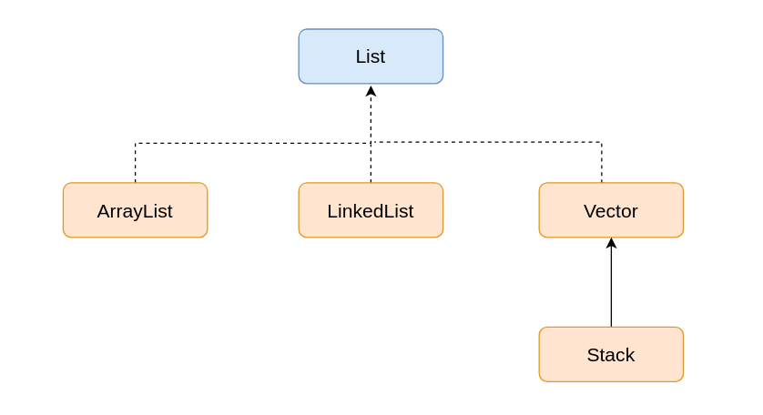

# ArrayList
* Mục đích để get. Arraylist không ưu tiên cho việc save mà ưu tiên cho get
* Khi chèn phần tử thì bộ nhớ sẽ phải tìm toàn bộ rồi chuyển data vùng dữ liệu sang chỗ mới
* Có thể insert duplicate element
* Có thể chèn null

# LinkedList
* Dữ liệu được lưu phân nhánh riêng biệt và liên bởi địa chỉ của phần tử tiếp theo.
* Linkedlist ưu tiên cho việc **lưu** chứ không phải get
* Khi chèn phần tử thì phải travel đến vị trí cần chèn và thay đổi địa chỉ xung quanh đó.
* Có thể insert duplicate element
* Có thể chèn null

# Vector
* Tương tự ArrayList nhưng được thực Vector được đồng bộ hóa còn ArrayList thì không
* Có thể insert duplicate element
* Có thể chèn null

# Stack
* Ngăn xếp các phần tử theo thứ tự vào trước ra sau.
* Có thể insert duplicate element
* Có thể chèn null