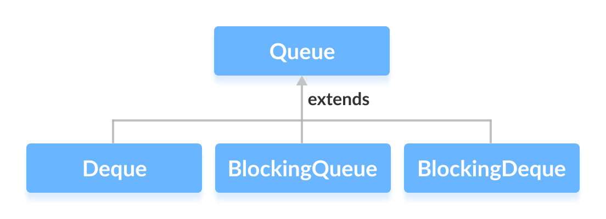

# Queue

* FIFO (First In, First Out)
* Các triển khai là: LinkedList, ArrayBlockingQueue, LinkedBlockingQueue, PriorityQueue, ConcurrentLinkedQueue

# Dequeue (double-ended queue):  
* FIFO (First In, First Out) + FILO (First In, Last Out)
* Triển khai ArrayDeque, LinkedList
* ArrayDeque: Không cho phép phần tử null. Throw NullPointerException
* LinkedList: cho phép phần tử null
* Tốc độ thêm và xóa phần tử ở cả hai đầu có độ phức tạp O(1).
* Tốc độ tìm và xoá ở giữa là O(n)

# BlockingQueue 
* Là Queue an toàn với thread mà không sử dụng synchronized block

# BlockingDeque 
* Là Deque an toàn với thread mà không sử dụng synchronized block