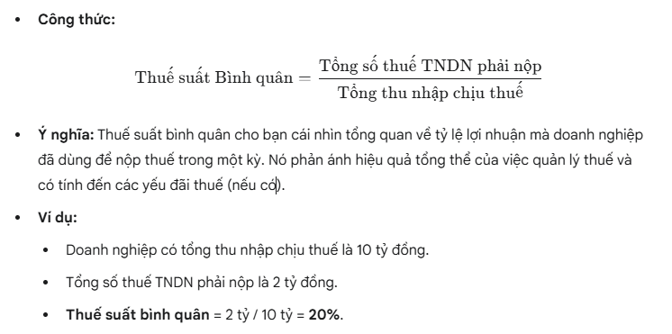

# Chương 1: Tổng quan doanh nghiệp + TCDN
## Doanh nghiệp 
### Định nghĩa
1. Tổ chức kinh tế có tên, được đăng ký kinh doanh theo pháp luật
2. Có tài sản, sản phẩm dịch vụ
3. Có trụ sở
### Mục tiêu
1. Tối đa hóa của cái/giá trị nội tại doanh nghiệp của cổ đông, chủ sở hữu thông qua lợi nhuận, giá trị cổ phiếu, giá trị sản phẩm, giá trị thương hiệu.
### Loại hình doanh nghiệp
1. Ở Việt Nam
* Công ty TNHH: Nhiều chủ sở hữu góp vốn và **chịu trách nhiệm tương ứng với vốn góp**. Công ty TNHH là một pháp nhân. **Không** được phát hành cổ phần. Tăng vốn từ thành viên hoặc vay vốn. TNHH 1 thành viên (1 chủ sở hữu). TNHH 2 thành viên trở lên **(2-50 chủ sở hữu)**
* Doanh nghiệp nhà nước: **Toàn bộ hoặc cổ phần** là nhà nước góp vốn chi phối. Ngoài mục tiêu kinh doanh thì có **thêm nhiệm vụ** chính trị, xã hội, ngoại giao.
* Công ty cổ phần: Vốn điều lệ được chi thành nhiều **cổ phần có giá trị bằng nhau**. Mỗi cổ động sở hữu số cố phần **tương ứng với mức độ góp vốn và trách nhiệm** về khoản nợ và nghĩa vụ tài sản. **Không giới hạn** cổ đông, **tối thiểu 3 người**
* Công ty hợp danh: Tương tự TNHH nhưng gồm 2 loại thành viên. Thành viên hợp danh, thành viên góp vốn. **Thành viên hợp danh chịu trách nhiệm vô hạn**, nghĩa là nếu công tu không đủ trả nợ thì thành viên hợp danh sẽ bị dùng các tài sản cá nhân để thanh toán. **Thành viên góp vốn chịu trách nhiệm hữu hạn** trong phạm vi góp vốn.
* Doanh nghiệp tự nhân: Chỉ một cá nhân sở hữu, **chịu trách nhiệm bằng toàn bộ tài sản của mình** với các nghĩa vụ vốn và nợ của doanh nhiệp

2. Thế giới
* Hợp tác xã: Không phải tối ưu lợi nhuận mà mực định phục vụ kinh tế, xã hội của các thành viên. Quyết định được biểu quyết bằng các vote bình đẳng
* Tổ chức phi lợi nhuận: Hoạt động vì mục tiêu xã hội, từ thiện, giáo dục, khoa học và tốn giáo. Lợi nhuận tập trung tái đầu tư vào tổ chức. Tổ chức thường được miễn thuế. Nguồn tài chính thường được tài trợ, quyên góp.
* Tập đoàn: Tổ chức gốm nhiều công ty công hoạt động đa lĩnh vực.
  
### Quan hệ tài chính trong doanh nghiệp
1. Nhà nước
2. Chủ thể hộ gia đình
3. Chủ thể doanh nghiệp
4. Chủ thể trung gian, kinh tế khác

## Tài chính doanh nghiệp
### Khái niệm tài chính doanh nghiệp
Là quá trình tạo ra, phân phối, sử dụng tiền trong doanh nghiệp.
> Khác với kế toán là công việc thực hiện **tính toán, ghi chép** lại những hoạt động tài chính** để tổng hợp** ra báo cáo.
### Quản trị tài chính doanh nghiệp
Là phân tích, xử lý các mối quan hệ trong tài chính doanh nghiệp để đưa ra 3 quyết định hiệu quả:
1. Quyết định đầu tư (dự án, sản phẩm, dịch vụ, con người)
2. Quyết định nguồn vốn (nguồn vay, huy độngc cổ phiếu, lợi nhuận,...)
3. Chia lợi nhuận (tái đầu tư + chia cổ tức)

> Nhà quản trị tài chính là duy động vốn + sử dụng hiệu quả + giám sát sử dụng
### Nguyên tắc trong quản trị tài chính doanh nghiệp
1. Nguyên tắc đánh đổi rủi ro và lợi nhuận.
2. Nguyên tắc giá trị thời gian của tiền tệ.
3. Nguyên tắc tận dụng đòn bẩy (Vốn vay và vốn chủ sở hữu)
4. Nguyên tắc tác động của thuế

### Yếu tố ảnh hưởng đến hoạt động quản trị tài chính doanh nghiệp
1. Hình thức pháp lý của doanh nghiệp
2. Đặc điểm kinh tế ngành
3. Môi trường kinh doanh trong nền kinh tế (sự ổn định của nền kinh tế, ảnh hưởng của giá cả thị trường, lãi suất và tiền thuế, sự cạnh tranh và tiến bộ kỹ thuật công nghệ, chính sách kinh tế và tài chính của Nhà nước, sự hoạt động của thị trường tài chính và hệ thống các tổ chức tài chính trung gian)
## Thị trường tài chính
### Định nghĩa
Là thị trường vốn được chuyến từ người dư thừa sang người cần theo nguyên tắc của thị trường (cổ phiếu, trái phiếu)
* Thị trường sơ cấp: đợt phát dành lần đầu của doanh nghiệp
* Thị trường thứ cấp: thị trường mua đi bán lại của nhà đầu tư trên thị trường với cố phiếu, trái phiếu của doanh nghiệp. Giá trị doanh nghiệp được thể hiện ở thị trường thứ cấp

# Chương 2: Báo cáo tài chính – Thuế và dòng tiền
## Báo cáo tài chính (BCTC)
Báo cáo tài chính là báo cáo tổng hợp và trình bày một cách tổng quát và toàn diện tình hình tài sản, nguồn vốn, công nợ, tình hình và kết quả hoạt động sản xuất, kinh doanh của doanh nghiệp trong một kỳ kế toán
> Phản ánh hiệu quả sử dụng vốn và lượng tiền phát sinh

### Bảng cân đối kế toán
1. Bảng cân đối kế toán là báo cáo tình hình **tài sản** và **nguồn vốn** của doanh nghiệp tại một thời điểm xác định.
2. Sắp xếp theo tính **thanh khoản (độ chuyển hóa thành tiền) giảm dần của tài sản** và thời gian trả nợ (ngắn/dài hạn) + vốn chủ sở hữu 

#### Nợ
1. Ngắn hạn: dưới 12 tháng từ các khoản vay **ngắn ở ngân hàng, tổ chức tín dụng hoặc các nhân** để thực hiện hoạt động ngắn hạn (lương, quỹ, chi tiêu, đầu tư ngắn hạn, đóng thuế, nợ, lãi)
2. Dài hạn: trên 12 tháng từ **ngân hàng, phát hành trái phiếu** mục đích cho phát triển dài hạn (đầu tư, xây dựng, phát triển kinh doanh)

###  Giá trị sổ sách và Giá trị thị trường
1. Giá trị sổ sách: là giá trị của tài sản hay vốn cổ đông được ghi trên bảng cân đối kế toán của doanh nghiệp
2. Giá trị thị trường: là mức giá nhận được nếu đem tài sản bán đi, phụ thuộc vào rủi ro và dòng tiền của tài sản đó. Có sự chênh lệch giữa hai giá trị này

### Báo cáo kết quả hoạt động kinh doanh
#### Định nghĩa
Hay còn gọi là Báo cáo lãi lỗ, Profit and Loss Statement - P&L là một báo cáo tài chính tổng hợp phản ánh tình hình và kết quả kinh doanh của doanh nghiệp trong một kỳ kế toán cụ thể

#### Mục đích
1. Đánh giá hiệu quả hoạt động: Cho biết công ty có kinh doanh hiệu quả, có lãi hay không.
2. Phân tích khả năng sinh lời: Giúp nhà đầu tư, chủ nợ và ban quản lý hiểu được các nguồn doanh thu và các loại chi phí, từ đó đánh giá khả năng tạo ra lợi nhuận.
3. Cơ sở tính toán thuế: Là căn cứ để xác định thu nhập chịu thuế và tính toán số thuế thu nhập doanh nghiệp phải nộp.
#### Hạng mục chính trong báo cáo kết quả tài chính
1. Doanh thu bán hàng (Revenue/Sales): Tổng tiền thu được từ việc bán hàng, cung cấp dịch vụ
2. Khoản giảm trừ doanh thu (Sales Deductions): chiếu khấu thương mại, khấu hao, chi phí phát sinh trong quá trình bán hàng
3. Doanh thu thuần về bán hàng/dịch (Net Revenue): Doanh thu kết quả sau khi trừ các khoản giảm trừ doanh thu **(1) - (2)**
4. Giá vốn bán hàng (Cost of Goods Sold - COGS): Cost liên quan đến nguyên vật liệu cấu thành sản phẩm, dịch vụ
5. Lợi nhuận gộp (Gross Profit): **Doanh thu thuần (3) - giá vốn bán hàng (4)**
6. Doanh thu hoạt động tài chính (Financial Income): Tiền lãi từ tiền gửi ngân hàng, lãi cho vay, cổ tức/lợi nhuận được chia, lãi từ hoạt động đầu tư tài chính.
7. Chi phí tài chính (Financial Expenses): Lãi vay ngân hàng, chi phí chuyển đổi ngoại tệ.
8. Chi phí bán hàng (Selling Expenses): marketing, hoa hồng, vận chuyển,...
9. Chi phí quản lý doanh nghiệp (General & Administrative Expenses - G&A): phí chung như thuê văn phòng, vận hành hành chính, khấu hao,...
10. Lợi nhuận thuần từ hoạt động kinh doanh (Operating Profit): Lợi nhuận gộp **(5) +** Doanh thu hoạt động tài chính **(6) -** Chi phí tài chính **(7) -** Chi phí bán hàng **(8) -** Chi phí quản lý doanh nghiệp **(9)**.
11. Thu nhập khác (Other Income): thanh lý tài sản,...
12. Chi phí khác (Other Expenses): thanh lý tài sản, pát hợp động, vi phạm,...
13. Lợi nhuận kế toán trước thuế (Profit Before Tax - PBT): Lợi nhuận thuần từ hoạt động kinh doanh **(10) +** Thu nhập khác **(11) -** Chi phí khác **(12)**.
14. Chi phí thuế thu nhập doanh nghiệp hiện hành và hoãn lại (Corporate Income Tax Expense): phần thuế nộp cho nhà nước
15. Lợi nhuận sau thuế thu nhập doanh nghiệp (Net Income/Profit After Tax - PAT):  Lợi nhuận kế toán trước thuế **(13) -** Chi phí thuế thu nhập doanh nghiệp **(14)**.

### Báo cáo lưu chuyển tiền tệ (Cash Flow Statement)
#### Mục đích
Đánh giá liệu công ty có tạo thêm được tiền mặt để sử dụng cho việc trả nợ hoặc đầu tư vào sản phẩm mới hay không.
#### Kết cấu
1. Dòng tiền từ hoạt động sản xuất – kinh doanh (SX-KD): tiền vào (hoạt động bán hàng, kinh doanh), tiền ra (lương nhân viên, nguyên vật liệu, thuế, lãi,...)
2. Dòng tiền từ hoạt động đầu tư: Mua sắm, xây dựng tài sản cố định/dài hạn.
3. Dòng tiền từ hoạt động tài chính:Vay, trả nợ nguồn vay và vốn chủ sở hữu.
#### Yếu tố ảnh hưởng dòng tiền
1. Thu nhập hay lợi nhuận dòng
2. Chi phí không bằng tiền
3. Thay đổi vốn lưu động
4. Đầu tư (vào tài sản cố định hay đầu tư tài chính ngắn hạn)
5. Các giao dịch chứng khoán
6. Nguyên tắc ghi nhận doanh thu và chi phí (nguyên tắc phát sinh)
   
#### Xác định dòng vào – dòng ra
Các thay đổi trong tài khoản tài sản (trừ tiền mặt), nợ phải trả, và vốn chủ sở hữu đều được phân loại là dòng vào hoặc dòng ra để xác định tổng thay đổi tiền mặt trong niên độ kế toán.
#### Dòng tiền tự do (Free Cash Flow – FCF)
Liên quan đến Vốn lưu động hoạt động ròng (Net Operating Working Capital – NOWC), được tính bằng Tài sản hoạt động ngắn hạn trừ Nợ hoạt động ngắn hạn (nợ không phải trả lãi)

## Thuế thu nhập doanh nghiệp
### Định nghĩa
Thuế thu nhập doanh nghiệp là loại thuế mà doanh nghiệp phải nộp cho Nhà nước dựa trên **lợi nhuận chịu thuế** mà họ tạo ra từ hoạt động sản xuất kinh doanh và các hoạt động khác. Đây là một khoản chi phí bắt buộc và ảnh hưởng trực tiếp đến lợi nhuận sau thuế của doanh nghiệp.

Chương này cũng bao gồm việc hiểu các vấn đề về thuế thu nhập doanh nghiệp, bao gồm thuế suất thu nhập doanh nghiệp. Cần lưu ý rằng thuế suất bình quân và thuế suất biên có thể khác nhau, và thuế suất biên là đối tượng quan trọng khi đưa ra các quyết định tài chính
### Thuế suất Bình quân (Average Tax Rate)

### Thuế suất Biên (Marginal Tax Rate)
Thuế suất biên là **tỷ lệ phần trăm thuế phải nộp trên mỗi đồng thu nhập chịu thuế TNDN tăng thêm (hoặc giảm bớt)** của doanh nghiệp. Nói cách khác, đó là mức thuế áp dụng cho đơn vị thu nhập cuối cùng hoặc đơn vị thu nhập sắp phát sinh.

Giả sử thuế suất TNDN phổ thông là 20%. Nếu doanh nghiệp có thêm 1 tỷ đồng thu nhập chịu thuế từ một dự án mới, thì 1 tỷ đồng đó sẽ bị đánh thuế 20%. Thuế suất biên trong trường hợp này là 20%.

## Khái niệm dòng tiền dưới góc độ nhà quản trị tài chính doanh nghiệp
Mục tiêu của nhà quản trị tài chính là tối đa hóa giá trị thị trường của cổ phiếu, không phải giá trị sổ sách. Dòng tiền tạo ra từ tài sản của doanh nghiệp phải bằng dòng tiền chuyển đến người cho vay và chủ doanh nghiệp. Lợi nhuận ròng được tính toán trên Báo cáo kết quả hoạt động kinh doanh không phải là dòng tiền ròng

Dưới đây là tổng hợp Chương 3: Phân tích Báo cáo tài chính, được định dạng theo kiểu `README.md` để dễ dàng tham khảo và nắm bắt các nội dung chính:

# Chương 3: Phân tích Báo cáo tài chính
## Một số vấn đề chung về phân tích tài chính
### Mục tiêu của phân tích tài chính:
1. Đánh giá kết quả và tình hình tài chính trong quá khứ và hiện tại.
2. Đánh giá tiềm lực tương lai và các rủi ro liên quan.
3. Đưa ra các khuyến nghị để đảm bảo tình hình tài chính luôn tốt và phát huy hiệu quả mọi nguồn lực.
### Đối tượng quan tâm phân tích tài chính:
1. **Nhà quản trị**: Đánh giá lĩnh vực thành công/chưa thành công, điểm mạnh/yếu, thay đổi cần thiết, đưa ra quyết định đầu tư/tài trợ, xây dựng phương pháp quản lý.
2. **Nhà đầu tư**: Quan tâm hoạt động kinh doanh, tỷ suất sinh lời kỳ vọng, rủi ro cấu trúc vốn, vị thế cạnh tranh.
3. **Chủ nợ**: Quan tâm mục đích vay, tổng số nợ, khả năng trả nợ, nguồn trả nợ.
4. **Người lao động & Nhà nước**: Người lao động quan tâm kết quả hoạt động, Nhà nước đánh giá, kiểm tra, kiểm soát hoạt động kinh doanh, tài chính, thực hiện nghĩa vụ.

### Nguồn thông tin sử dụng:
1. Các báo cáo tài chính kiểm toán (Bảng cân đối kế toán, Báo cáo kết quả hoạt động kinh doanh, Báo cáo lưu chuyển tiền tệ, Thuyết minh BCTC).
2. Báo cáo thường niên, thông cáo báo chí, các báo cáo cho UBCKNN (nếu là DN niêm yết).
3. Các nguồn khác (báo cáo từ tổ chức độc lập, bài báo).

### Các tiêu chuẩn sử dụng:
1. Kết quả quá khứ của doanh nghiệp.
2. Thước đo thực tế (chuẩn mực trong tài chính).
3. Các tiêu chuẩn của ngành (bình quân ngành, benchmarking).

### Quy trình phân tích tài chính (5 bước)**:
1. Xác định mục tiêu và điều kiện phân tích.
2. Thu thập số liệu.
3. Xử lý số liệu.
4. Phân tích và lý giải số liệu.
5. Báo cáo kết quả/kiến nghị.

## Các phương pháp phân tích tài chính

### Phân tích theo xu hướng (Phân tích dọc):
1. Kỹ thuật tính toán giá trị chênh lệch và tỷ lệ phần trăm chênh lệch của các chỉ số qua nhiều năm.
2. Giúp nhận diện xu hướng tăng/giảm (tốt lên/xấu đi) của chỉ số.
3. Thường áp dụng cho Bảng cân đối kế toán và Báo cáo kết quả hoạt động kinh doanh.
4. Có 2 cách tính: lấy một năm làm gốc hoặc so sánh từng năm với năm liền trước.
### Phân tích theo cơ cấu (Phân tích ngang):
1. Kỹ thuật xác định khuynh hướng thay đổi của từng khoản mục bằng cách tính toán và so sánh tỷ trọng của chúng.
2. Trong Báo cáo KQKD: tỷ trọng so với doanh thu.
3. Trong Bảng CĐKT: tỷ trọng so với tổng tài sản/tổng nguồn vốn.
4. **Ưu điểm**: Cho phép so sánh giữa các công ty có quy mô khác nhau, giúp nhận ra sự thay đổi về khả năng kiểm soát chi phí.

### Phân tích các hệ số tài chính

Là cách xem xét các dữ liệu kế toán dưới dạng tương đối, cho phép so sánh và phát hiện mối tương quan giữa các thông tin tài chính khác nhau, cũng như so sánh giữa các công ty khác nhau về quy mô.

Khi phân tích từng hệ số, cần quan tâm đến **cách tính**, **ý nghĩa đo lường**, **ý nghĩa của giá trị cao/thấp**, và **hạn chế của hệ số đó**.

Các nhóm tỷ số chủ yếu:
1. **Tỷ số thanh khoản**: Đo lường khả năng thanh toán nợ ngắn hạn.
    *   **Tỷ số thanh khoản hiện thời**: (Tài sản lưu động / Nợ ngắn hạn).
    *   **Tỷ số thanh khoản nhanh**: (Tài sản lưu động - Hàng tồn kho) / (Nợ ngắn hạn).
2. **Tỷ số hiệu quả hoạt động**: Đánh giá hiệu suất sử dụng tài sản và khả năng tạo ra doanh thu.
    *   Vòng quay hàng tồn kho.
    *   Vòng quay khoản phải thu.
    *   Vòng quay tài sản cố định.
    *   Vòng quay tổng tài sản.
3. **Hệ số đòn bẩy tài chính (Hệ số nợ)**: Phản ánh mức độ sử dụng nợ và khả năng trả nợ.
    *   Tỷ số nợ trên tổng tài sản.
    *   Tỷ số nợ trên vốn chủ sở hữu.
    *   Tỷ số khả năng trả lãi (Times Interest Earned Ratio - TIE).
    *   Tỷ số thanh toán tiền mặt (Cash Coverage).
4. **Hệ số về khả năng sinh lời**.
5. **Chỉ số thị trường**.

### Phương pháp DUPONT
1. Là kỹ thuật phân tích nhằm chia nhỏ các chỉ số **ROA** (Tỷ suất sinh lời trên tổng tài sản) và **ROE** (Tỷ suất sinh lời trên vốn chủ sở hữu) thành các bộ phận liên hệ với nhau.
2.  **Mục đích**: Đánh giá tác động của từng bộ phận lên kết quả cuối cùng, giúp nhà quản lý nội bộ có cái nhìn cụ thể và ra quyết định cải thiện tình hình tài chính.
3. **ROE chịu tác động của 3 yếu tố chính**:
    1.  Tỷ suất lợi nhuận ròng.
    2.  Vòng quay tổng tài sản.
    3.  Hệ số đòn bẩy tài chính.

NOTE:
* Tiền theo Lãi đơn = Tiền * lãi suất * Năm
* Tiền theo Lãi kép = Tiền * (1 + lãi suất) ^ năm
* Tiền = Tiền theo Lãi kép / (1 + lãi suất) ^ năm
* Lãi suất = (Tiền theo Lãi kép / Tiền) ^ (1 / năm) - 1
* Lãi suất thực = (1 + lãi suất/kỳ tính lãi trong năm) ^ tổng kỳ tính lãi - 1
* Lãi thực = Tiền * (1 + lãi suất/kỳ tính lãi trong năm) ^ tổng kỳ tính lãi
* Lãi mỗi kỳ = lãi suất/kỳ tính lãi trong năm
* Giá trị tương lai của dòng tiền đều:
  * **Cuối năm** FVA(n) = Tiền * ((1 + lãi suất) ^ năm - 1) / lãi suất
  * **Đầu năm** FVA(n) = Tiền * ((1 + lãi suất) ^ năm - (1 + lãi suất)) / lãi suất
  * **Biến thiên** FVA(n) = Σ(t=1,n) tiền * (1 +  lãi suất) ^ (t-1) 
* Giá trị hiện tại dòng tiền đều:
  * **Cuối năm** PVA(n) = Tiền * ((1 + lãi suất) ^ năm - 1) / (lãi suât * (1 + lãi suất) ^ năm)
  * **Đầu năm** PVA(n) = Tiền * (1 + lãi suất) * (1/ lãi suất - 1/ (lãi suất * (1 + lãi suất) ^ năm))
  
* Giá trị hiện tại dòng tiền **biến thiên**: PVA(n) =  Σ(t=1,n) tiền * (1/(1 + lãi suất)) ^ t

* Giá trị hiện tại dòng tiền 
  * **Vô hạn**: PVA(n) = Tiền * Σ(t=1,n) (1/(1 + lãi suất)) ^ t = Tiền * (1/lãi suất - 1/(lãi suất * (1 + lãi suất) ^ năm))
  * **Đều vô hạn** PVA(n) = Tiền / Lãi suất
* Chiếu khấu dòng tiền (DCF)
  * PV = Σ(t=0,năm) CF(t)/(1 + chiết khấu) ^ t

