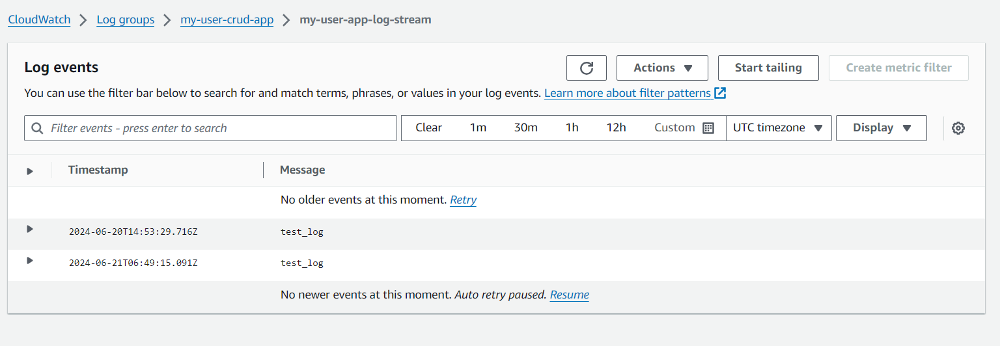

# Demo
Thực hiện call api với data và push lên cw với timestamp, message
Có những cách đẩy log lên cw:
* Sử dụng trực tiếp sdk aws
* Ghi log source và sử dung các công tụ agent (cloudwatch agent, prometheus, data dog agent) ảnh xạ từ ec2 sang cw (cách này hay dùng)

