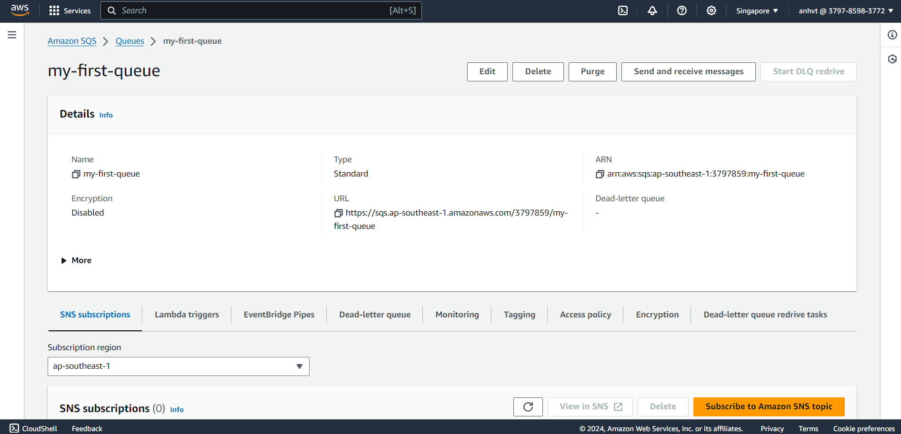

# Tạo IAM và SQS AWS



# Consumner
Với cùng 1 queue trong code có nhiều code listener thì SQS listener sẽ nhận message ngẫu nhiên

# Publicher
Với demo này thực hiện public các message qua called api

## List api
### POST /v1/publish/{msg}
CURL: 
```shell
curl --location --request POST 'localhost:8080/v1/publish/data' \
--data ''
```

Call postman


Debug log


### POST /v1/publish
CURL:
```shell
curl --location 'localhost:8080/v1/publish' \
--header 'Content-Type: application/json' \
--data '{
    "id": 1,
    "message": "first message"
}'
```

Debug log:
```shell
send1: {"id":1,"message":"first message"}
Received0 message:{"id":1,"message":"first message"}
```

### POST /v2/publish
CURL:
```shell
curl --location 'localhost:8080/v2/publish' \
--header 'Content-Type: application/json' \
--data '{
    "id": 1,
    "message": "first message"
}'
```

Debug log:
```shell
send2: MessageRequestDto{id='1', message='first message'}
Received0 message:{"id":1,"message":"first message"} 
```

### POST /v3/publish
CURL:
```shell
curl --location 'localhost:8080/v3/publish' \
--header 'Content-Type: application/json' \
--data '{
    "id": 3,
    "message": "Third message"
}'
```

Debug log:
```shell
send3: MessageRequestDto{id='3', message='Third message'}
Received0 message:{"id":3,"message":"Third message"}
```
