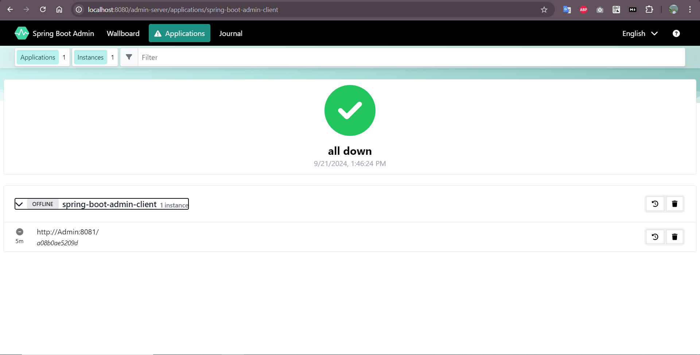
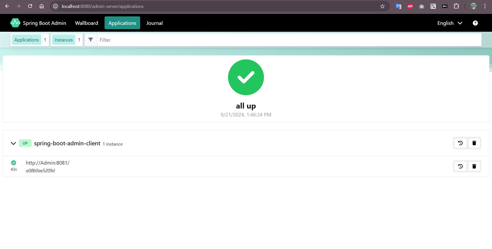
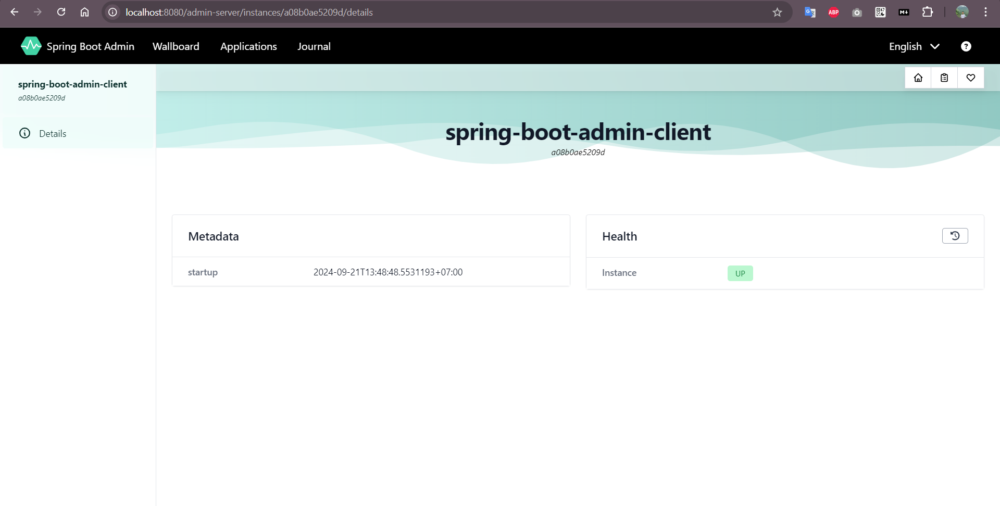
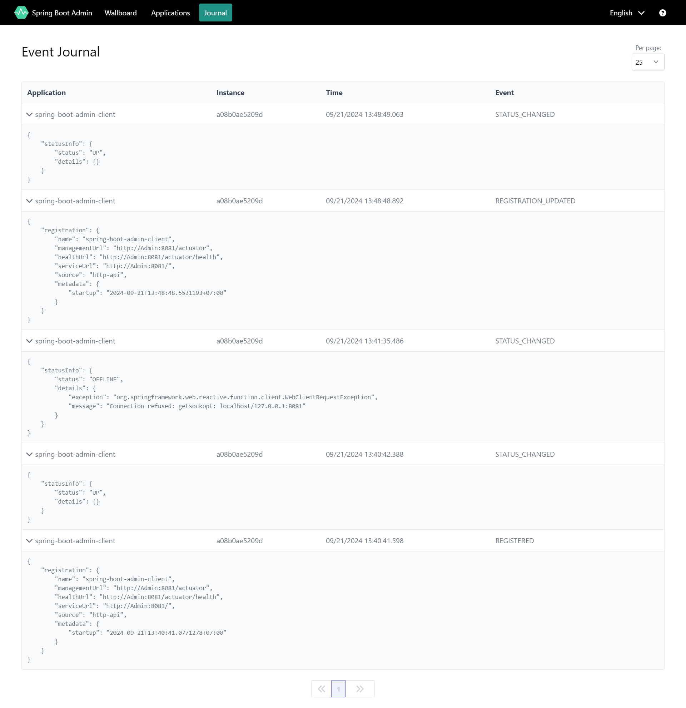

# Dependency
Server service
```sh
<dependency>
    <groupId>de.codecentric</groupId>
    <artifactId>spring-boot-admin-starter-server</artifactId>
</dependency>
```

Client service
```sh
<dependency>
    <groupId>de.codecentric</groupId>
    <artifactId>spring-boot-admin-starter-client</artifactId>
</dependency>
```

# Configuration
Server application.properties
```sh
server.port=8080
server.servlet.context-path=/admin-server
```

Client application.properties
```sh
server.port=8081
spring.boot.admin.client.url=http://localhost:8080/admin-server
```

# UI admin
URL
```sh
http://localhost:8080/admin-server
```
All services down


All services up


Client service


Event Journal
