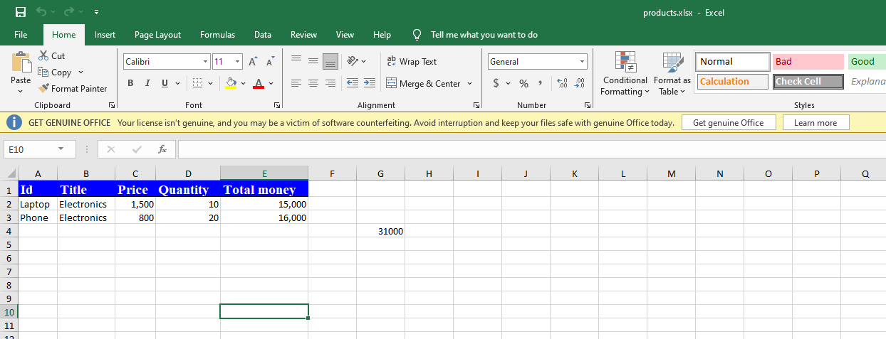
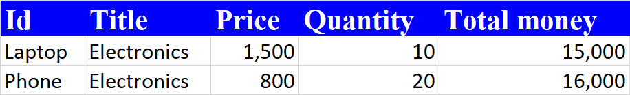
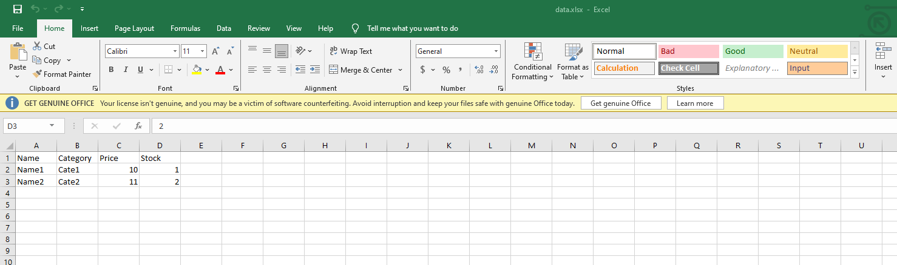
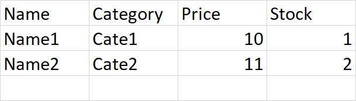

# Dependency
```xml
<dependency>
    <groupId>org.apache.poi</groupId>
    <artifactId>poi-ooxml</artifactId>
    <version>5.2.3</version>
</dependency>
```

# Export example (products.xlsx)
```shell
localhost:8080/api/products/export
```



# Import example (data/data.xlsx)
```shell
localhost:8080/api/products/import
```

