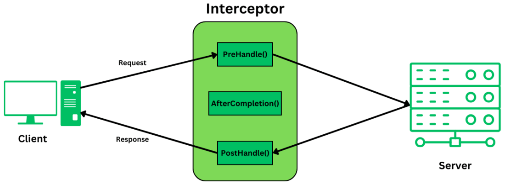

# Interceptor



# Filter


# Log console
```shell
TimeFilter - init
testBeanWebConfig
testBeanFilter
testBeanInterceptor
WebConfig - addInterceptors
2024-09-18T21:58:36.864+07:00  INFO 8340 --- [spring-boot-filter-interceptor] [           main] o.s.b.w.embedded.tomcat.TomcatWebServer  : Tomcat started on port 8080 (http) with context path '/'
2024-09-18T21:58:36.875+07:00  INFO 8340 --- [spring-boot-filter-interceptor] [           main] s.SpringBootFilterInterceptorApplication : Started SpringBootFilterInterceptorApplication in 2.971 seconds (process running for 3.861)
2024-09-18T21:59:21.131+07:00  INFO 8340 --- [spring-boot-filter-interceptor] [nio-8080-exec-1] o.a.c.c.C.[Tomcat].[localhost].[/]       : Initializing Spring DispatcherServlet 'dispatcherServlet'
2024-09-18T21:59:21.131+07:00  INFO 8340 --- [spring-boot-filter-interceptor] [nio-8080-exec-1] o.s.web.servlet.DispatcherServlet        : Initializing Servlet 'dispatcherServlet'
2024-09-18T21:59:21.133+07:00  INFO 8340 --- [spring-boot-filter-interceptor] [nio-8080-exec-1] o.s.web.servlet.DispatcherServlet        : Completed initialization in 2 ms
TimeFilter - doFilter1
TimeInterceptor - preHandle
UserController :1
UserController :java.util.Collections$3@3ed54f23
TimeInterceptor - postHandle1
TimeInterceptor - postHandle2 1726671561167
TimeInterceptor - afterCompletion1
TimeInterceptor - afterCompletion2 1726671561167
TimeInterceptor - afterCompletion3 null
TimeFilter - doFilter2: 2024-09-18T14:59:21.226104600Z
```

## Giải thích log
```shell
1. Application started
2. TimeFilter.init(FilterConfig filterConfig)
        TimeFilter - init
3. Initial beans (Class @Configuration > TimeFilter > TimeInterceptor) 
        testBeanWebConfig
        testBeanFilter
        testBeanInterceptor
4. WebConfigInterceptor.addInterceptors(InterceptorRegistry registry) đăng ký interceptor
        WebConfig - addInterceptors
        
5. Call api
6. TimeFilter.doFilter(ServletRequest request, ServletResponse response, FilterChain chain)
        TimeFilter - doFilter1
        Call chain.doFilter(request, response);
                Call TimeInterceptor.preHandle() -> TimeInterceptor - preHandle
                Running in controller
                Call TimeInterceptor.postHandle() -> 
                        TimeInterceptor - postHandle1
                        TimeInterceptor - postHandle2 1726671561167
                Call TimeInterceptor.afterCompletion() ->
                        TimeInterceptor - afterCompletion1
                        TimeInterceptor - afterCompletion2 1726671561167
                        TimeInterceptor - afterCompletion3 null
        TimeFilter - doFilter2: 2024-09-18T14:59:21.226104600Z (continue in doFilter() method)
```