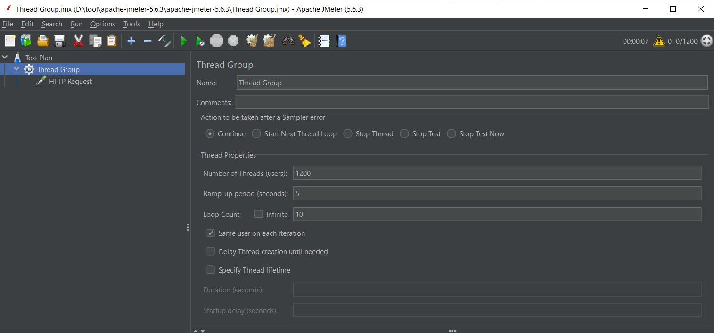

# Dependency
```xml
<dependency>
    <groupId>com.h2database</groupId>
    <artifactId>h2</artifactId>
    <scope>runtime</scope>
</dependency>
```

# Define properties source
```properties
spring.datasource.url=jdbc:h2:mem:testdb
spring.datasource.driverClassName=org.h2.Driver
spring.datasource.username=sa
spring.datasource.password=password
spring.jpa.database-platform=org.hibernate.dialect.H2Dialect
spring.jpa.defer-datasource-initialization=true
# Init sql file
spring.sql.init.data-locations=classpath:data.sql
```

# Setup connection pool with hikari
```properties
spring.datasource.hikari.pool-name=connection-pool
spring.datasource.hikari.connection-timeout=3000
spring.datasource.hikari.maximum-pool-size=50
spring.datasource.hikari.minimum-idle=10
spring.datasource.hikari.idle-timeout=600000
spring.datasource.hikari.max-lifetime=1800000
spring.datasource.hikari.register-mbeans=true
# Logging trace hikari connection pool
logging.level.com.zaxxer.hikari=TRACE
```

# Testing with jmeter
Download apache-jmeter-5.6.3.zip in link
> https://jmeter.apache.org/download_jmeter.cgi

Run batch file in path
> apache-jmeter-5.6.3\bin\jmeter.bat

Create [Thread Group]: Number of Threads (user), Ramp-up period (seconds), Loop Count


Create [HTTP Request]: Server Name, Port, Path


