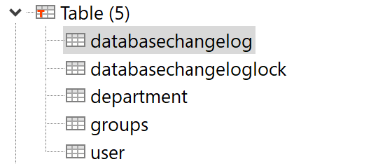

# Dependices
```xml
<dependency>
    <groupId>org.liquibase</groupId>
    <artifactId>liquibase-core</artifactId>
</dependency>
```

# Định nghĩa properties
```properties
# Datasource url
spring.datasource.url=jdbc:postgresql://192.168.1.5:5432/postgres
spring.datasource.username=postgres
spring.datasource.password=password
spring.jpa.database-platform=org.hibernate.dialect.PostgreSQLDialect

# Liquibase
spring.liquibase.enabled=true
spring.liquibase.change-log=classpath:db/changelog/master.xml
```

# Master file changlog
```xml
<?xml version="1.0" encoding="UTF-8" standalone="no"?>
<databaseChangeLog xmlns="http://www.liquibase.org/xml/ns/dbchangelog" xmlns:xsi="http://www.w3.org/2001/XMLSchema-instance"
                   xsi:schemaLocation="http://www.liquibase.org/xml/ns/dbchangelog http://www.liquibase.org/xml/ns/dbchangelog/dbchangelog-2.0.xsd">

    <include file="db/changelog/migration/_0.1.0_migrate.sql" />
    <include file="db/changelog/migration/_0.2.0_migrate.sql" />

</databaseChangeLog>
```

# Migration sql file
```sql
-- liquibase formatted sql
CREATE TABLE groups (
    id BIGINT GENERATED BY DEFAULT AS IDENTITY NOT NULL,
    created_time TIMESTAMP(6) WITHOUT TIME ZONE,
    description VARCHAR(500),
    modified_time TIMESTAMP(6) WITHOUT TIME ZONE,
    name VARCHAR(100),
    CONSTRAINT "groupsPK" PRIMARY KEY (id)
);

ALTER TABLE groups
    ADD CONSTRAINT UC_GROUPSDESCRIPTION_COL UNIQUE (description);

ALTER TABLE groups 
    ADD CONSTRAINT UC_GROUPSNAME_COL UNIQUE (name);
```

# Results in database


* databasechangelog
* databasechangeloglock
* department
* groups
* user


> Record changelog using sql and comment in sql files.


> Inserted data in department table