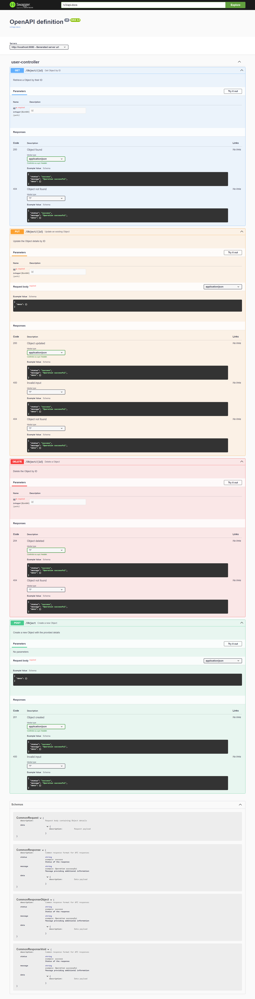

# Dependency
```shell
<!-- https://mvnrepository.com/artifact/org.springdoc/springdoc-openapi-starter-webmvc-ui -->
<dependency>
    <groupId>org.springdoc</groupId>
    <artifactId>springdoc-openapi-starter-webmvc-ui</artifactId>
    <version>2.5.0</version>
</dependency>
```

# API docs
```java
@Operation(summary = "Create a new Object", description = "Create a new Object with the provided details")
@ApiResponses(value = {
        @ApiResponse(responseCode = "201", description = "Object created",
                content = @Content(mediaType = "application/json",
                        schema = @Schema(implementation = CommonResponse.class))),
        @ApiResponse(responseCode = "400", description = "Invalid input")
})
@PostMapping
public ResponseEntity<CommonResponse<Object>> createObject(
        @RequestBody @Schema(description = "Request body containing Object details", implementation = CommonRequest.class) CommonRequest<Object> request) {
    // Implementation here
    CommonResponse<Object> response = new CommonResponse<>();
    response.setStatus("success");
    response.setMessage("Object created");
    response.setData(request.getData()); // Replace with actual Object
    return new ResponseEntity<>(response, HttpStatus.CREATED);
}
```

# URL SWAGGER
```shell
http://localhost:8080/swagger-ui/index.html#/
```



