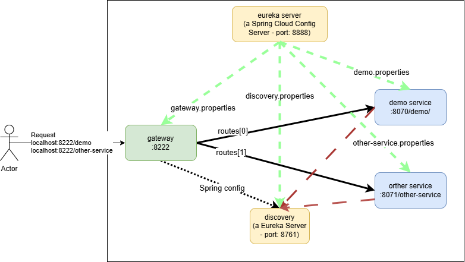

# Service Discovery


# Eureka Server Service
## Dependencies
```xml
<properties>
    <java.version>17</java.version>
    <spring-cloud.version>2024.0.0</spring-cloud.version>
</properties>
<dependencies>
    <dependency>
        <groupId>org.springframework.boot</groupId>
        <artifactId>spring-boot-starter-web</artifactId>
    </dependency>
    <dependency>
        <groupId>org.springframework.cloud</groupId>
        <artifactId>spring-cloud-config-server</artifactId>
    </dependency>
    <dependency>
        <groupId>org.springframework.boot</groupId>
        <artifactId>spring-boot-starter-test</artifactId>
        <scope>test</scope>
    </dependency>
</dependencies>
<dependencyManagement>
    <dependencies>
        <dependency>
            <groupId>org.springframework.cloud</groupId>
            <artifactId>spring-cloud-dependencies</artifactId>
            <version>${spring-cloud.version}</version>
            <type>pom</type>
            <scope>import</scope>
        </dependency>
    </dependencies>
</dependencyManagement>
```

## Main with @EnableConfigServer
```java
@SpringBootApplication
@EnableConfigServer
public class EurekaServerServiceApplication {
    public static void main(String[] args) {
        SpringApplication.run(EurekaServerServiceApplication.class, args);
    }

}
```

## Properties
### Folder
```
- application.properties
- configurations/demo.properties
                /discovery.properties
                /gateway.properties
                /other-service.properties
```
### application.properties
```properties
spring.application.name=eureka-server-service
server.port=8888

spring.profiles.active=native
spring.cloud.config.server.native.search-locations=classpath:/configurations
```

### discovery.properties
```properties
eureka.instance.hostname=localhost
eureka.client.register-with-eureka=false
eureka.client.fetch-registry=false
eureka.client.service-url.defaultZone=http://${eureka.instance.hostname}:${server.port}/eureka/

server.port=8761
```

### gateway.properties
```properties
eureka.client.register-with-eureka=false
server.port=8222

spring.application.name=gateway
spring.cloud.gateway.discovery.locator.enabled=true

# http://localhost:8222/demo
spring.cloud.gateway.routes[0].id=demo
spring.cloud.gateway.routes[0].uri=http://localhost:8070/demo
spring.cloud.gateway.routes[0].predicates[0]=Path=/demo/**

# http://localhost:8222/other-service
spring.cloud.gateway.routes[1].id=other-service
spring.cloud.gateway.routes[1].uri=http://localhost:8071/other-service
spring.cloud.gateway.routes[1].predicates[0]=Path=/other-service/**

management.tracing.sampling.probability=1.0
```

### demo.properties
```properties
eureka.instance.hostname=localhost
eureka.client.service-url.defaultZone=http://localhost:8761/eureka

server.port=8070
spring.application.name=demo
server.servlet.context-path=/demo
management.tracing.sampling.probability=1.0
```

### other-service.properties
```properties
eureka.instance.hostname=localhost
eureka.client.service-url.defaultZone=http://localhost:8761/eureka

server.port=8071
spring.application.name=other-service
server.servlet.context-path=/other-service
management.tracing.sampling.probability=1.0
```


# Discovery Module
## Dependencies
```xml
<properties>
    <java.version>17</java.version>
    <spring-cloud.version>2024.0.0</spring-cloud.version>
</properties>
<dependencies>
    <dependency>
        <groupId>org.springframework.boot</groupId>
        <artifactId>spring-boot-starter-actuator</artifactId>
    </dependency>
    <dependency>
        <groupId>org.springframework.cloud</groupId>
        <artifactId>spring-cloud-starter-config</artifactId>
    </dependency>
    <dependency>
        <groupId>org.springframework.cloud</groupId>
        <artifactId>spring-cloud-starter-netflix-eureka-server</artifactId>
    </dependency>
    <dependency>
        <groupId>org.springframework.boot</groupId>
        <artifactId>spring-boot-starter-test</artifactId>
        <scope>test</scope>
    </dependency>
</dependencies>

<dependencyManagement>
    <dependencies>
        <dependency>
            <groupId>org.springframework.cloud</groupId>
            <artifactId>spring-cloud-dependencies</artifactId>
            <version>${spring-cloud.version}</version>
            <type>pom</type>
            <scope>import</scope>
        </dependency>
    </dependencies>
</dependencyManagement>
```

## Main with @EnableEurekaServer
```java
@EnableEurekaServer
@SpringBootApplication
public class DiscoveryApplication {
    public static void main(String[] args) {
        SpringApplication.run(DiscoveryApplication.class, args);
    }
}
```

## application.properties
```properties
spring.application.name=discovery
spring.config.import=optional:configserver:http://localhost:8888
```

# Gateway Module
## Dependencies
```xml
<properties>
    <java.version>17</java.version>
    <spring-cloud.version>2024.0.0</spring-cloud.version>
</properties>
<dependencies>
    <dependency>
        <groupId>org.springframework.boot</groupId>
        <artifactId>spring-boot-starter-actuator</artifactId>
    </dependency>
    <dependency>
        <groupId>org.springframework.cloud</groupId>
        <artifactId>spring-cloud-starter-config</artifactId>
    </dependency>
    <dependency>
        <groupId>org.springframework.cloud</groupId>
        <artifactId>spring-cloud-starter-gateway</artifactId>
    </dependency>
    <dependency>
        <groupId>org.springframework.cloud</groupId>
        <artifactId>spring-cloud-starter-netflix-eureka-client</artifactId>
    </dependency>
    <dependency>
        <groupId>org.springframework.boot</groupId>
        <artifactId>spring-boot-starter-test</artifactId>
        <scope>test</scope>
    </dependency>
</dependencies>
<dependencyManagement>
    <dependencies>
        <dependency>
            <groupId>org.springframework.cloud</groupId>
            <artifactId>spring-cloud-dependencies</artifactId>
            <version>${spring-cloud.version}</version>
            <type>pom</type>
            <scope>import</scope>
        </dependency>
    </dependencies>
</dependencyManagement>
```

## Main
```java
@SpringBootApplication
public class GatewayApplication {
    public static void main(String[] args) {
        SpringApplication.run(GatewayApplication.class, args);
    }
}
```

## application.properties
```properties
spring.application.name=gateway
spring.config.import=optional:configserver:http://localhost:8888
```

# Demo service or Other services
## Dependencies
```xml
<properties>
    <java.version>17</java.version>
    <spring-cloud.version>2024.0.0</spring-cloud.version>
</properties>
<dependencies>
    <dependency>
        <groupId>org.springframework.boot</groupId>
        <artifactId>spring-boot-starter-web</artifactId>
    </dependency>
    <dependency>
        <groupId>org.springframework.cloud</groupId>
        <artifactId>spring-cloud-starter-config</artifactId>
    </dependency>
    <dependency>
        <groupId>org.springframework.cloud</groupId>
        <artifactId>spring-cloud-starter-netflix-eureka-client</artifactId>
    </dependency>
    <dependency>
        <groupId>org.springframework.boot</groupId>
        <artifactId>spring-boot-starter-test</artifactId>
        <scope>test</scope>
    </dependency>
</dependencies>
<dependencyManagement>
    <dependencies>
        <dependency>
            <groupId>org.springframework.cloud</groupId>
            <artifactId>spring-cloud-dependencies</artifactId>
            <version>${spring-cloud.version}</version>
            <type>pom</type>
            <scope>import</scope>
        </dependency>
    </dependencies>
</dependencyManagement>
```

## application.properties
```properties
spring.application.name=demo
spring.config.import=optional:configserver:http://localhost:8888
```

```
spring.application.name=other-service
spring.config.import=optional:configserver:http://localhost:8888
```

## Main và Controller
```java
@SpringBootApplication
public class DemoApplication {
    public static void main(String[] args) {
        SpringApplication.run(DemoApplication.class, args);
    }
}
```

```java
@RestController
@RequestMapping("/index")
public class IndexController {
    @GetMapping
    public String hello() {
        return "hello";
    }
    @GetMapping("/hi")
    public String hi() {
        return "hi";
    }
}
```