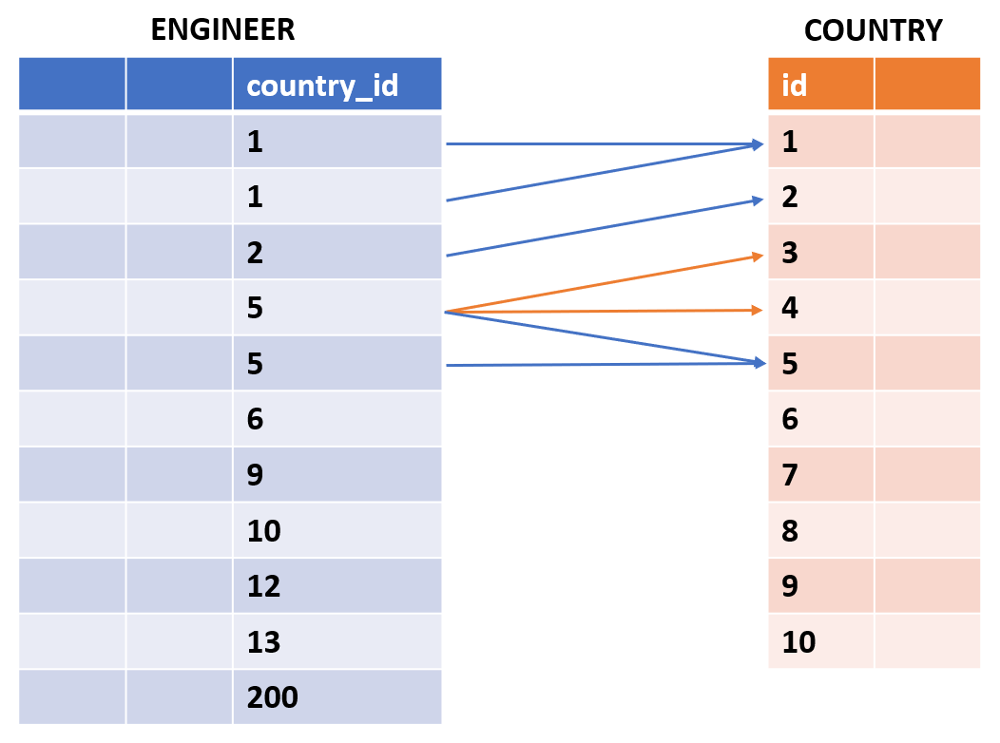
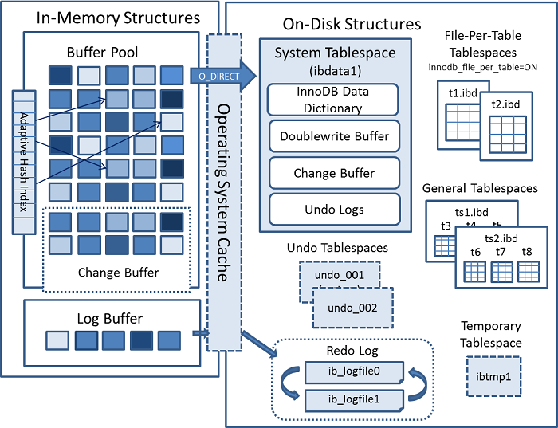
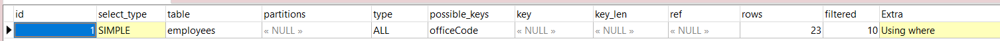
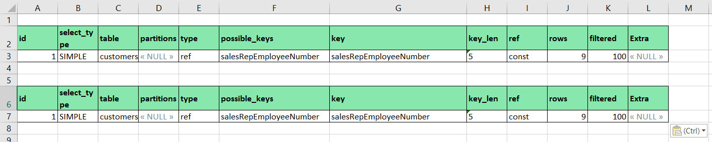
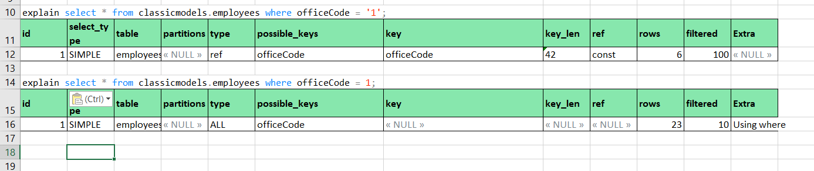

# MySQL ALL

1. Install và tính chất
   * MySQL installer
   * Docker
   * Tính chất
2. SQL trong MySQL
   * DDL
   * DML
   * Table (CREATE TABLE __ /CREATE TABLE __ AS SELECT __, Temp table)
   * Select (1/n trường, WHERE, ORDER BY, Sử dụng các hàm, GROUP BY, JOIN,..)
   * Insert (from 1 recors/select table)
   * Update
   * Delete

3. Cấu trúc MySQL Database
4. Tối ưu SQL trong MySQL
   * SQL Explain
   * SQL Explain analyze
   * SQL Index
   * SQL Partition
   * Tối ưu query
   * Tối ưu transaction
5. Tối ưu tham số trong MySQL
   * Buffer Cache Hit
   * Table Cache Hit
   * Definition Cache Hit
   * Temporary Table trên Memory
6. Sao lưu, khôi phục trong MySQL
   * Logical Backup
   * Replica
7. So sánh với các loại Database
   * MySQL vs Postgre SQL
   * MySQL vs PL/SQL


## 1. Install
### MySQL installer
**Windows**
1. Manual instal
* Download zip file: https://downloads.mysql.com/archives/community/
* Unzip
* Run cmd trong folder
```sh
mysqld.exe --initialize
```
* Root account trong file <name_pc>.err
* Conncent vào MySQL bằng cmd sau
```sh
mysql -u root -p
```
2. Automation install

* Download file installer tương ứng thiết bị: https://dev.mysql.com/downloads/installer/
* Run installer
* Setting path, root account,...

3. Và có thể thử thêm các cách khác như XAMPP, MySQL Workbench

**Ubuntu (Linux/MacOS)**
> Với MacOS có thể sử dụng chung cách này hoặc sử dụng installer tương tự trên windows
* Terminal update chỉ mục các package hệ thống và ứng dụng
```sh
sudo apt update
```

* Cài đặt package mysql-server
```sh
sudo apt install mysql-server
```

* Start mysql-server
```sh
sudo systemctl start mysql.service
```

* Cầu hình tài khoản root của MySQL cho lần đầu tiên
```sh
sudo mysql
```

* Cài đặt password
```sh
ALTER USER 'root'@'localhost' IDENTIFIED WITH mysql_native_password BY 'password';
```

* Thực thi script installation để cài đặt password/xóa anonymouse uses/diable root login remotely/xóa test database/reload privilege table
```sh
sudo mysql_secure_installation
```

* Check MySQL hoạt động
```sh
sudo systemctl status mysql
```

* Connect MySQL với tài khoản root (syntax: mysql -u \<user> -p \<password>)
```sh
mysql -u root -p
```

**Tính chất**
ACID là gì?


Transaction như nào?

## 2. SQL trong MySQL
### 2.1 DDL
> DDL là Data Definition Language (Ngôn ngữ định nghĩa dữ liệu)
> CREATE, ALTER, DROP, RENAME

### 2.2 DML
> DML là Data Manipulation Language (Ngôn ngữ thao tác dữ liệu)
> SELECT, INSERT, UPDATE, DELETE

### 2.3 Table
**Định nghĩa**
> Table là tập hợp những cột và hàng (Field/Column và Record/Row)
> Field/Column là thuộc tính của table, biểu diễn tên gọi cho data trong đó
> Record/Row là tập hợp các giá trị biểu hiện khác nhau về cùng 1 đối tượng

Ví dụ:

| Id       |      Name     |  Cost |
|----------|:-------------:|------:|
| 1        |  left-aligned |  1600 | <= Đây là Record/Row
| 2        |    centered   |    12 | <= Đây là Record/Row
| 3        | right-aligned |     1 | <= Đây là Record/Row

Field/Column: ID, Name, Cost. 
Field/Column được định nghĩa là số, ký tự, date, bool,..


**Tạo table**
```sh
CREATE TABLE \<table> (
	\<tên column1> \<kiểu dữ liệu> \<options>, 
	\<tên column2> \<kiểu dữ liệu> \<options>,
	...
);
```

Ví dụ:
```sh
CREATE TABLE data (
  -- Kiểu số nguyên
  id INT PRIMARY KEY AUTO_INCREMENT,
  tiny_int_data TINYINT NOT NULL,
  small_int_data SMALLINT NOT NULL,
  medium_int_data MEDIUMINT NOT NULL,
  int_data INT NOT NULL,
  big_int_data BIGINT NOT NULL,

  -- Kiểu số thực
  float_data FLOAT NOT NULL,
  double_data DOUBLE NOT NULL,
  decimal_data DECIMAL(10,2) NOT NULL,

  -- Kiểu chuỗi
  char_data CHAR(255) NOT NULL,
  varchar_data VARCHAR(255) NOT NULL,
  text_data TEXT NOT NULL,
  medium_text_data MEDIUMTEXT NOT NULL,
  long_text_data LONGTEXT NOT NULL,

  -- Kiểu thời gian và ngày tháng
  date_data DATE NOT NULL,
  time_data TIME NOT NULL,
  datetime_data DATETIME NOT NULL,
  timestamp_data TIMESTAMP NOT NULL,
  year_data YEAR NOT NULL,

  -- Kiểu dữ liệu nhị phân
  binary_data BINARY(255) NOT NULL,
  varbinary_data VARBINARY(255) NOT NULL,
  blob_data BLOB NOT NULL,
  mediumblob_data MEDIUMBLOB NOT NULL,
  longblob_data LONGBLOB NOT NULL,

  -- Kiểu enum và set
  enum_data ENUM('value1', 'value2', 'value3') NOT NULL,
  set_data SET('value1', 'value2', 'value3') NOT NULL,

  -- Kiểu Boolean
  bool_data BOOLEAN NOT NULL,

  -- Kiểu JSON
  json_data JSON NOT NULL,

  -- Khóa phụ và Index
  INDEX idx_int_data (int_data),  -- Tạo index cho cột int_data
  INDEX idx_date_data (date_data),  -- Tạo index cho cột date_data
  FOREIGN KEY (enum_data) REFERENCES another_table(enum_data_column),  -- Khóa ngoại tham chiếu đến bảng khác
  UNIQUE (varchar_data, bool_data)  -- Tạo unique key cho tổ hợp varchar_data và bool_data
);
```

**Tạo table với data từ select**
```sh
CREATE TABLE new_tbl [AS] SELECT * FROM orig_tbl;
```

Ví dụ:
```sh
CREATE TABLE test (a INT NOT NULL AUTO_INCREMENT,
		PRIMARY KEY (a), KEY(b))
		ENGINE=InnoDB SELECT b,c FROM test2;
```

**Temp table**
Temporary table là table để lưu dữ liệu tạm thời. Dữ liệu sẽ được xoá khi kết thúc session nên trong mỗi session riêng biệt có thể tạo 2 temporary table giống nhau. Khi drop database thì sẽ không tự động xáo data trong temporary table.
Temp table sẽ không hiển thị trong lệch show tables;

```sh
CREATE TEMPORARY TABLE temp_transaction (
id VARCHAR(50) NOT NULL,
session_id VARCHAR(20) NOT NULL,
amount FLOAT(4,2) NOT NULL DEFAULT 0.00
);

-- or

CREATE TEMPORARY TABLE new_tbl SELECT * FROM orig_tbl LIMIT 0;
```

### 2.3 Select
**All fields**
```sh
SELECT * FROM table;
```

**Chỉ định các fields cụ thể**
```sh
SELECT id, name, age FROM user;

-- or with alias

SELECT u.id, u.name, u.age FROM user u;
```

**Select với condition**
```sh
SELECT OrderID, Quantity,
CASE
   WHEN Quantity > 30 THEN "The quantity is greater than 30"
   WHEN Quantity = 30 THEN "The quantity is 30"
   ELSE "The quantity is under 30"
END
FROM OrderDetails;
```

**Select sử dụng method**
```sh
-- concat string
SELECT CONCAT("SQL ", "Tutorial ", "is ", "fun!") AS ConcatenatedString;

-- lower case
SELECT LOWER("SQL Tutorial is FUN!");

-- trim string
SELECT TRIM('    SQL Tutorial    ') AS TrimmedString;

-- parse to date 
SELECT DATE("2017-06-15");

-- check null (null: 1, not null: 0)
SELECT ISNULL(NULL); 

-- more and more
```

**Where**
Các biểu thức điều kiện
* =	Equal	
* \>	Greater than	
* <	Less than	
* \>=	Greater than or equal	
* <=	Less than or equal	
* <>	Not equal. Note: In some versions of SQL this operator may be written as !=	
* BETWEEN	Between a certain range	
* LIKE	Search for a pattern	
* IN	To specify multiple possible values for a column

```sh
-- So sánh bằng
SELECT * FROM Customers
WHERE Country = 'Mexico';  

-- So sánh trong khoảng
SELECT * FROM orders
WHERE order_date BETWEEN '2023-01-01' AND '2023-03-31';
   AND price BETWEEN 1000 AND 5000;

-- So sánh với like
-- nhiều ký tự %
SELECT * FROM customers WHERE name LIKE '%Smith%';

-- nhiều ký tự _
SELECT * FROM customers WHERE name LIKE '_Smith_';

```

**Order by**
Sắp xếp records theo thứ tự chỉ định
DESC: Giảm dần
ASC: Tăng dần - Mặc định

```sh
SELECT id, name, age FROM user
ORDER BY id;

-- Sort theo nhiều field
SELECT id, name, age FROM user
ORDER BY id, name DESC;
```

**Sử dụng các hàm**
Tìm kiếm thêm tại: https://www.w3schools.com/mysql/mysql_ref_functions.asp

**GROUP BY**
Gom các record có các field cùng giá trị
```sh
SELECT COUNT(CustomerID), Country
FROM Customers
GROUP BY Country
ORDER BY COUNT(CustomerID) DESC;
```

**JOIN**

*Nguồn trong ảnh

**Joining table**
Cơ chế join table có thể phải duyệt toàn bộ table nên có thể ảnh hưởng đến hiệu năng. 
Version MySQL version 5 có Nested loop join và Merge join.
Từ version 8 MySQL có bổ sung thêm Hash join.
* Nested loop join: 2 vòng lặp. Vòng lặp bên ngoài duyệt qua các record ở table bên trái, hay còn gọi là drive table. Vòng lặp bên trong duyệt qua các record ở table bên phải, gọi là join table
* Hash join: Hash build + Hash probe
<br>-Hash build: Sử dụng table bé hơn và hash join column
<br>-Hash probe: Duyệt table lớn + hash join columns + tìm kiếm trong hash table ở hashphase

* Merge join (Sort merge join):
<br>-Sắp xếp 2 table theo FK
<br>-Tận dụng việc sắp xếp giảm số lượng row sequence scan


**Thứ tự thực hiện các thành phần trong câu select**
1. FROM
2. WHERE
3. GROUP BY
4. HAVING
5. SELECT
6. DISTINCT
7. ORDER BY
8. LIMIT/OFFSET
### 2.4 Insert
**Format**
```sh
INSERT INTO table_name (column1, column2, column3, ...)
VALUES (value1, value2, value3, ...);

-- or

INSERT INTO table_name
VALUES (value1, value2, value3, ...);
```

**Insert nhiều hơn 1 bản ghi và có giá trị cụ thể**
```sh
INSERT INTO table_name
VALUES 
(record1.value1, record1.value2, record1.value3, ...),
(record2.value1, record2.value2, record2.value3, ...),
(record3.value1, record3.value2, record3.value3, ...);
```


**Insert data từ câu lệch truy vấn**
```sh
INSERT INTO table2 (column1, column2, column3, ...)
SELECT column1, column2, column3, ...
FROM table1
WHERE condition;
```

### 2.5 Update
Update những record thoả mãn với giá trị chỉ định
```sh
UPDATE table_name
SET column1 = value1, column2 = value2, ...
WHERE condition;
```

Ví dụ:
```sh
UPDATE customers
SET email = 'newemail@example.com'
WHERE customer_id = 1;  
```
### 2.6 Delete
Xoá những record thoả mãn điều kiện trong table
```sh
DELETE FROM table_name
WHERE condition;
```

Ví dụ:
```sh
-- Xoá với record = 1
DELETE FROM orders
WHERE order_id = 1;

-- Xoá tất cả records
DELETE FROM orders;
```

### 2.7 Truncate
Xoá tất cả data table
```sh
TRUNCATE TABLE table_name;
```

Ví dụ:
```sh
TRUNCATE TABLE customers;
```

So sánh Truncate và Delete
|Tính năng |	TRUNCATE	|DELETE|
|---|---|---|
|Tốc độ|	Nhanh hơn|	Chậm hơn|
|Xóa dữ liệu|	Xóa tất cả dữ liệu trong bảng|	Xóa dữ liệu dựa trên điều kiện|
|Xóa khóa chính|	Có|	Không|
|Yêu cầu xác nhận|	Không|	Có|
|Khôi phục dữ liệu|	Khó khăn|	Dễ dàng|

### 2.8 Drop 
Drop data và layout table khỏi database. Lệch drop có thể xoá cả temporary table
```sh
DROP TABLE table_name;
```

Ví dụ:
```sh
DROP TABLE customers;

-- Xoá temporary table
DROP TABLE temporary_table;
```

**Drop có ràng buộc**
Bỏ ràng buộc (Xoá khoá ngoại or drop table chứa khoá ngoại) > Drop table

> Giả sử bạn có hai bảng orders và order_details. Bảng orders có cột order_id, bảng order_details có các cột order_id, product_id, quantity và unit_price. Bảng order_details có ràng buộc ngoại khóa tham chiếu đến cột order_id của bảng orders

```sh
-- Xoá liên kết khoá ngoại
ALTER TABLE order_details DROP FOREIGN KEY order_details_fk_orders;

-- Xoá table
DROP TABLE orders;

```

### 2.9 View
View là khung nhìn tổng hợp kết quả data từ nhiều talbe với những điều kiện với mục đích là 
* Chỉ cung cấp dữ liệu cần thiết
* Che giấu sự phức tạp, liên trong tables
* Tổ chức dữ liệu từ nhiều nguồn không đồng nhất

Nhược điểm:
* Không thể chứa mệnh đề COMPUTE hoặc COMPUTE BY
* Vì tạo ra bảng tạm nên view sẽ làm tốn tài nguyên, chậm hệ thống.
* Không thể chứa mệnh đề ORDER BY trừ khi có TOP n
* Không thể chứa mệnh đề INTO
* Không thể chứa các table tạm
* Có tối đa 1024 cột
Cú pháp:
```sh
CREATE [OR REPLACE] VIEW [db_name.]view_name [(column_list)]
AS
  select-statement;
```

Ví dụ:
```sh
-- Tạo view
CREATE VIEW SalePerOrder
   AS
   SELECT orderNumber,
   SUM  (quantityOrdered * priceEach) total
   FROM orderDetails
   GROUP by orderNumber
   ORDER BY total DESC

-- Sử dụng view
SELECT total
   FROM salePerOrder
   WHERE orderNumber = 1000
```


### 2.10 Procedure và Function
Stored Procedure và Function là một tập hợp các câu lệnh SQL dùng để thực thi một nhiệm vụ nhất định. Nó hoạt động giống như một hàm trong các ngôn ngữ lập trình khác.

Procedure có thể hiểu là void method (Có thể có IN, OUT hoặc INOUT là parameter)
Function có thể hiểu là function có kiểu trả về sử dụng return và IN là parameter. Nếu câu lệnh RETURN trả về một giá trị thuộc loại khác, thì giá trị đó sẽ bị ép buộc về loại thích hợp. Ví dụ: nếu một hàm chỉ định giá trị ENUM hoặc SET trong mệnh đề RETURNS, nhưng câu lệnh RETURN trả về một số nguyên, thì giá trị được trả về từ hàm là ENUM hoặc SET

Ví dụ procedure:
```sh
-- Bình thường delimiter (Dấu phân cách) là dấu chấm phẩy (;)
-- nhưng procedure là tập hợp lệnh nên bắt buộc phải sử dụng ;
-- => Cần delimiter khác để đánh dấu kết thúc câu định nghĩa
delimiter //

-- Định nghĩa IN và OUT
CREATE PROCEDURE citycount (IN country CHAR(3), OUT cities INT)
-- Đánh đâu bắt đầu tập hợp lệch sql
   BEGIN
   -- Minh hoạ query select sử dụng country truyền vào
   SELECT COUNT(*) INTO cities FROM world.city
   WHERE CountryCode = country; -- Kết thúc 1 câu sql

   -- Ngoài ra có thê thực hiện update, insert, delete và sử dụng reture
   -- Kết thúc định nghĩa procedure
   END//

-- Tái định nghĩa delimiter cho các câu lệch sql   
delimiter ;
```

Cách gọi đến procedure
```sh
-- Call đến procedure
CALL citycount('JPN', @cities); -- cities in Japan

-- Hiển thị ra kết quả
SELECT @cities;
```

Ví dụ Function:
```sh
delimiter //

-- Định nghĩa function với parameter country
CREATE FUNCTION citycount (country CHAR(3))
RETURNS INT -- Định nghĩa kiểu trả về
DETERMINISTIC -- luôn trả về cùng một kết quả khi giống input
-- NOT DETERMINISTIC: trả về kết quả thực tế phụ thuộc hệ thống
BEGIN
  DECLARE cities INT;
  
  SELECT COUNT(*) INTO cities
  FROM world.city
  WHERE CountryCode = country;

  RETURN cities; -- Trả vê kết quả
END//

delimiter ;
```


Cách gọi Function:
```sh
SELECT citycount('USA');
```
### 2.11 Trigger
Trigger là một đối tượng được định danh trong CSDL và được gắn chặt với một sự kiện xảy ra trên một bảng nào đó (điều này có nghĩa là nó sẽ được tự động thực thi khi xảy ra một sự kiện trên một bảng). Các sự kiện này bao gồm: chèn (Insert), xóa (Delete) hay cập nhật (Update) một bảng.

Mục đích: 
* Đảm bảo, tự động, kiểm soát những thay đổi dữ liệu và toàn vẹn dữ liệu
* Tự động công việc theo schedule

Lưu ý:
* Không sử dụng được trigger với temporary table
* Không thể sử dụng giao tác (transaction) trong trigger
* Tất cả các trigger của csdl không được trùng tên.
Tạo trigger:
```sh
CREATE TRIGGER trigger_name BEFORE|AFTER INSERT|UPDATE|DELETE ON tablename
FOR EACH ROW sql-code

-- Ví dụ
CREATE TRIGGER ins_sum BEFORE INSERT ON account
FOR EACH ROW SET @sum = @sum + NEW.amount;
````

Xoá trigger
```sh
ALTER TRIGGER, SHOW CREATE TRIGGER, hoặc SHOW TRIGGER STATUS
```

Show triggers
```sh
SELECT * FROM Information_Schema.Trigger
WHERE 
   Trigger_schema = 'database_name' -- all trigger database
   AND Event_object_table = 'table_name'; -- all trigger table
```

Detail trigger
```sh
SELECT * FROM Information_Schema.Trigger
WHERE Trigger_schema = 'database_name' AND
Trigger_name = 'trigger_name';
```

Ví dụ trigger sử dụng procedure
```sh
-- Tạo procedure
delimiter //

CREATE PROCEDURE citycount (IN country CHAR(3), OUT cities INT)
BEGIN
  SELECT COUNT(*) INTO cities
  FROM world.city
  WHERE CountryCode = country;
END//

delimiter ;


-- Tạo trigger
delimiter //

CREATE TRIGGER after_country_update
AFTER UPDATE ON world.country
FOR EACH ROW
BEGIN
  DECLARE city_count INT;

  -- Gọi stored procedure citycount
  CALL citycount(NEW.CountryCode, city_count);

  -- Ghi kết quả vào bảng log hoặc thực hiện tác vụ khác
  INSERT INTO country_changes (CountryCode, CityCount, ChangeTime)
  VALUES (NEW.CountryCode, city_count, NOW());
END//

delimiter ;
```

### 2.12 Transaction
START TRANSACTION or BEGIN: Đánh dấu bắt đầu transaction.<br>
COMMIT: Commit (lưu vào disk) trạng thái hiện tại trong transaction<br>
ROLLBACK: Khôi phục transaction về trạng thái, loại bỏ thay đổi từ đầu hoặc commit gần nhất.<br>
SET autocommit: Set trạng thái tự động commit mặc định.<br>
SAVEPOINT: Là các điểm trong transaction lưu trạng thái dữ liệu trước đó để roll đến thời điểm savepoint thay vì rollback từ đầu. Thời điểm savepoint này dữ liệu được lưu trữ tạm thời. Trường hợp Id tự tăng sẽ thực hiện tăng liên tục mà không giữ chỗ
Việc START TRANSACTION không đồng nghĩa với disable autocommit<br>

Ví dụ:
```sh
SET autocommit=0;
START TRANSACTION;
SELECT @A:=SUM(salary) FROM table1 WHERE type=1;
UPDATE table2 SET summary=@A WHERE type=1;
COMMIT;
SET autocommit=1;
```

Ví dụ về savepoint, rollback
```sh
START TRANSACTION;

-- Bước 1: Thực hiện thao tác đầu tiên
INSERT INTO my_table (column1) VALUES ('value1'); -- Id=1

-- Tạo savepoint đầu tiên
SAVEPOINT savepoint1;

-- Bước 2: Thực hiện thao tác thứ hai
INSERT INTO my_table (column1) VALUES ('value2'); -- Id=2

-- Tạo savepoint thứ hai
SAVEPOINT savepoint2;

-- Bước 3: Thực hiện thao tác thứ ba
INSERT INTO my_table (column1) VALUES ('value3'); -- Id=3

-- Nếu có lỗi trong bước 3, hoàn tác về savepoint1
-- Khi này Id sẽ tính tiếp là 4
ROLLBACK TO SAVEPOINT savepoin1;

-- Xóa savepoint thứ hai, không cần nữa
RELEASE SAVEPOINT savepoint2;

COMMIT;
```

**Tính chất ACID trong transaction:**
* Atomicity (nguyên tử): Các thao tác trong transaction có kết quả thông nhất như nguyên tử. Tất cả thành công or tất cả không thành công (Abort or commit)
* Consistency (nhất quán): Transaction sẽ được database từ trạng thái hợp lệ này sang trạng thái hợp lệ khác. Trạng thái trước và sau luôn đúng, tuân thủ thiết kế, chỉ khác giá trị data.
* Isolation (Cô lập): Mỗi transaction, dữ liệu sẽ bị cố lập và không bị ảnh hưởng bởi transaction khác.
* Durability (Bền vững): Khi transaction thành công thì trạng thái dữ liệu phải được đồng bộ xuống database.

**Những vẫn đề khi transaction isolation is not done**
* Dirty read: Transaction T2 đọc data chưa commit trong transaction T1
=> Khi T1 rollback thì T2 sử dụng sai
* Non-repeatable reads: Dữ liệu cần đọc không giống nhau qua các nhiều lần đọc. Xảy ra khi có transaction khác update cùng resource

* Phantom reads: Đọc dữ liệu mà không chắc nó sẽ tồn tại. Tương tự như non-repeatable reads nhưng xảy ra khi có transaction khác insert thêm resource.

**Những định nghĩa về isolation levels:**
* Read uncommitted - Đọc chưa xác nhận
Mọi thay đổi từ transaction khác đểu có thể đọc được mà không cần committed -> nảy sinh vấn đề dirty reads
* Read committed - Đọc đã được xác nhận
Transaction chỉ đọc dữ liệu đã committed từ transaction hoàn thành -> Có thể nảy sinh non-repeatable reads
* Repeatable Read - Đọc có thể lặp lại
Transaction đảm bảo đữ liệu được đọc không thay đổi giữa các lần đọc (có thể tran khác đã thay đổi record) -> Có thể nảy sinh phantom-reads
* Serialiable - Chuỗi hóa (Highest Isolation, Lowest Performance)
   1. Read Method: Khóa các row và table transaction sử dụng để đảm bảo data không thay đổi
   2. Write Method: Khóa các row và table (khi insert) đảm bảo transaction khác không thể can thiệp
   3. Serializable Snapshot Isolation (SSI): Khi một transaction bắt đầu, hệ thống sẽ tạo ra một snapshot của dữ liệu cơ sở dữ liệu hiện tại. Mỗi transaction sẽ đọc từ snapshot này, đảm bảo rằng dữ liệu đọc được là nhất quán và không bị thay đổi bởi các transaction khác đang thực hiện đồng thời. 


**Các loại lock**
* Share Lock: (Read-only lock) chỉ được phép đọc chứ không được ghi. Có thể nhiều transaction thực hiện trên 1 đơn vị dữ liệu bị Share lock
* Exclusive Lock: (Write lock) được phép đọc + ghi data. Tại 1 thời điểm 1 exclusive lock transaction chỉ tác dụng trên 1 đơn vị data. Share lock KHÔNG thể đọc data bị lock trong Exclusive lock
Exclusive lock thường được áp dụng mức độ cô lập Serializable để đảm báo các vấn đề non-repeatable read, dirty read, phantom.
* Update lock: được phép đọc + ghi data.Tại 1 thời điểm 1 Update lock transaction chỉ tác dụng trên 1 đơn vị data. 
Share lock CÓ thể đọc data bị lock trong Exclusive lock.
Update lock thường được áp dụng mức độ cô lập Read committed và serializable.

**Các kiểu quản lý concurrency**
1. Pessimistic concurrency
* Locking: Pessimistic concurrency thường sử dụng cơ chế locking để đảm bảo rằng chỉ có một transaction được phép truy cập và thay đổi dữ liệu vào cùng một thời điểm.
* Khi một transaction muốn thực hiện thao tác đọc hoặc ghi trên một tài nguyên (ví dụ: hàng hoá trong bảng), nó sẽ yêu cầu khóa phù hợp với mức độ quyền cần thiết.
* Mức độ khóa (Lock Granularity): Mức độ khóa có thể từ tối thiểu (nhỏ nhất là hàng) đến tối đa (lớn nhất là toàn bộ bảng).
* Pessimistic concurrency thường áp dụng khóa tại mức độ hàng (row-level locking) hoặc mức độ bảng (table-level locking) tùy thuộc vào nhu cầu của transaction và quy mô của hệ thống.

* Mức độ cô lập (Isolation Level): Pessimistic concurrency thường áp dụng các mức độ cô lập cao để đảm bảo rằng các transaction không gây ra các vấn đề như dirty read, non-repeatable read và phantom read.
Các mức độ cô lập phổ biến như Serializable và Repeatable Read được sử dụng để đảm bảo tính nhất quán của dữ liệu trong khi các transaction đang chạy.
Ví dụ trong việc update sản phẩm
```sh
-- Bắt đầu transaction A với mức độ cô lập Serializable
BEGIN TRANSACTION ISOLATION LEVEL SERIALIZABLE;

-- Yêu cầu khóa Exclusive cho hàng hoá có ProductID = 123
SELECT * FROM Products WHERE ProductID = 123 FOR UPDATE;

-- Thực hiện cập nhật số lượng hàng
UPDATE Products SET Quantity = Quantity - 10 WHERE ProductID = 123;

-- Commit transaction A
COMMIT;
```

2. Optimistic concurrency
* Fetch data kèm theo version hiện tại. Tất cả các transaction đều có thể fetch data mà không lo ngại vấn đề blocking.
* Update data, đồng thời thêm một version mới.
* Commit transaction. Bây giờ mới là lúc acquire lock. Bác Gấu kiểm tra version cũ của record đó có trùng với version hiện tại mà bác Gấu biết không. Nếu đúng thì cho phép update, đồng thời cập nhật version mới của data. Sau đó release lock. Nếu sai version thì.. tất nhiên rồi, lệnh update không thành công.
* Khi update thất bại thì retry ở tầng application level

## 3. Cấu trúc MySQL Database


**Buffer pool/Buffer cache:** Là vùng bộ nhớ lưu data tạm trên disk. Buffer pool được lưu trữ dưới dạng các page (16KB) và có hai trạng thái là dirty page (data có thay đổi nhưng chưa lưu xuống dish) và clean (data thay đổi hoặc có data thay đổi những vừa được flush xuống disk.)

**Redo log:** là nơi lưu những thay đổi DML(insert, update, delete) và lưu bằng các redo_logfile trong disk

**Change buffer:** là nơi lưu trữ data tạm thời của các bảng sử dụng index, trước khi lưu vào chính các table đó (Insert, update, delete)

**Adaptive hash index:** là cơ chế nhận biết dự liệu nào được truy cập nhiều sẽ được đặt trong memory để truy cập nhanh hơn

**Log buffer:** Là một vùng lưu trữ trong bộ nhớ lưu các thông tin thay đổi để ghi xuống file dưới ổ cứng. Kích thước mặc định là 16MB.
Tham khảo: https://tech.cybozu.vn/yeu-to-can-ban-can-biet-khi-tuning-innodb-trong-mysql-a3140/

**tablespace:** Là khái niệm logic quản lý lưu vật lý các table có cùng tính chất. Có thể tự tạo tablespace để lưu dữ liệu cùng tính chất (tablespace thông tin KH, tablespace thông tin nhân viên)

**System tablespace (ibdata1):** Là tablespace của hệ thống (MẶC ĐỊNH - KHÔNG CAN THIỆP)

**Undo tablespace:** là tablespace lưu data cũ trong transaction để rollback

**Temp tablespace (ibtmp1):** là table tạm có sẵn, sẽ được giải phóng sau session

**General tablespace** là các tablespace được tạo theo nhu câu quản lý tập trung các bảng
Cú pháp tạo:
```sh
CREATE TABLESPACE `DATA_TBS1` ADD DATAFILE 'data1.ibd';
CREATE TABLE table1(
   id INT PRIMARY KEY AUTO_INCREMENT,
   name VARCHAR(100)
) tablespace DATA_TBS1;
```

**Doublewrite buffer files:** là một cơ chế quan trọng trong InnoDB của MySQL nhằm đảm bảo tính toàn vẹn dữ liệu và bảo vệ chống lại sự cố ghi một phần (partial page writes). Cơ chế này giúp ngăn ngừa mất mát dữ liệu và đảm bảo rằng các trang dữ liệu (pages) của cơ sở dữ liệu được ghi một cách chính xác vào đĩa.
## 4. Tối ưu SQL trong MySQL
### 4.1 SQL Explain
> Lệnh EXPLAIN trong MySQL được sử dụng để hiển thị kế hoạch thực thi của một câu truy vấn SELECT. Nó cung cấp thông tin chi tiết về cách MySQL dự định thực thi câu truy vấn của bạn, bao gồm việc sử dụng các chỉ mục, thứ tự truy vấn các bảng, và các thao tác cần thiết để lấy kết quả.

Ví dụ:
```sh
EXPLAIN SELECT * FROM employees WHERE officeCode = 1;
```

Kết quả:


Giải thích kết quả:
* id: Số định danh cho từng phần của truy vấn. Các truy vấn đơn giản thường có id là 1, trong khi các truy vấn phức tạp hoặc truy vấn con có thể có nhiều giá trị id.
* select_type: Loại của SELECT. Các giá trị phổ biến bao gồm:
   * SIMPLE: Truy vấn đơn giản không có truy vấn con hoặc union.
   * PRIMARY: Truy vấn ngoài cùng trong trường hợp có truy vấn con.
   * SUBQUERY: Truy vấn con được chứa bên trong truy vấn khác.
   * DERIVED: Truy vấn con trong FROM clause (bảng dẫn xuất).
* table: Tên của bảng mà hàng này của kế hoạch thực thi đề cập tới.
* partitions: Các phân vùng được sử dụng bởi bảng.
* type: Loại kết nối giữa các bảng. Các giá trị phổ biến bao gồm:
   * ALL: Quét toàn bộ bảng (table scan).
   * index: Quét toàn bộ chỉ mục.
   * range: Quét các hàng trong một phạm vi chỉ mục.
   * ref: Tìm các hàng khớp với giá trị từ cột đã chỉ mục.
   * eq_ref: Giống như ref, nhưng chỉ một hàng khớp cho mỗi tổ hợp từ bảng trước đó.
   * const, system: Bảng có giá trị hằng số hoặc chỉ có một hàng.
* possible_keys: Các chỉ mục có thể được sử dụng để tìm hàng.
* key: Chỉ mục thực tế được sử dụng.
* key_len: Chiều dài của khóa được sử dụng.
* ref: Cột hoặc hằng số được so sánh với chỉ mục.
* rows: Số lượng hàng mà MySQL ước tính phải đọc để tìm các hàng khớp.
* filtered: Phần trăm các hàng được lọc bởi điều kiện WHERE.
* Extra: Thông tin bổ sung. Một số giá trị phổ biến bao gồm:
   * Using where: Điều kiện WHERE được áp dụng để lọc hàng.
   * Using index: Truy vấn chỉ sử dụng chỉ mục để lấy dữ liệu, không cần truy cập bảng.
   * Using filesort: MySQL cần thực hiện sắp xếp tạm thời.
   * Using temporary: MySQL cần sử dụng bảng tạm thời để lưu trữ kết quả.

### 4.2 SQL Explain Analyze
> Lệnh ANALYZE có thể cung cấp thêm thông tin về việc thực thi truy vấn trong thực tế:

```sh
ANALYZE SELECT * FROM employees WHERE officeCode = 1;
```

Kết quả của ANALYZE sẽ cung cấp thông tin chi tiết hơn về kế hoạch thực thi, bao gồm cả thời gian thực tế. Chú ý khi thực hiện với câu lệch DML (INSERT/UPDATE/DELETE)


### 4.3 Index
Index gồm: Unique index, Single-Column Index, composite index
Unique index: Dành có index đảm bảo data duy nhất (ví dụ như id, username...)
Composite index: 2 hoặc nhiều cột có thể data không duy nhất

```sh
CREATE UNIQUE INDEX idx_unique ON table_name (column1, column2, ...);

CREATE INDEX idx_composite ON table_name (column1, column2, ...);
```

#### Single-Column Index: Index chỉ sử dụng duy nhất 1 cột. Index

Composite index: Thứ tự và việc sử dụng cột không chỉ trong điểu kiện where


#### Kiểu dữ liệu ảnh hưởng đến việc sử dụng index
**TH1: Kiểu số (int)**
```sh
-- Định nghĩa cột là int và khai báo index
CREATE TABLE `customers` (
   ...
  `salesRepEmployeeNumber` int DEFAULT NULL,
  ...
  KEY `salesRepEmployeeNumber` (`salesRepEmployeeNumber`),
) 
-- So sánh 2 cách sử dụng '1504' và 1504
explain select * from classicmodels.customers where salesRepEmployeeNumber = '1504'

explain select * from classicmodels.customers where salesRepEmployeeNumber = 1504

-- KẾT QUẢ EXPLAIN: Cả 2 câu select đều sử dụng index -> Hiện năng không khác biệt
```

Kết quả so sánh explain


**TH2: Kiểu ký tự (varchar)**
```sh
-- Định nghĩa varchar và khai báo index cột officeCode
CREATE TABLE `employees` (
   ...
  `officeCode` varchar(10) NOT NULL,
  ...
  KEY `officeCode` (`officeCode`),
  ...
  CONSTRAINT `employees_ibfk_2` FOREIGN KEY (`officeCode`) REFERENCES `offices` (`officeCode`)
) 

-- So sánh 2 cách sử dụng '1' và 1
explain select * from classicmodels.employees where officeCode = '1';


explain select * from classicmodels.employees where officeCode = 1;

-- KẾT QUẢ EXPLAIN: ='1' CÓ sử dụng index, =1 KHÔNG sử dụng index (*Kết quả so sánh như ảnh dưới)
```

Kết quả so sánh explain


### 4.4 Partition
### 4.5 Tối ưu query
### 4.6 Tối ưu transaction


## 5. Tối ưu tham số trong MySQL
## 6. Sao lưu, khôi phục trong MySQL
## 7. So sánh với các loại Database
