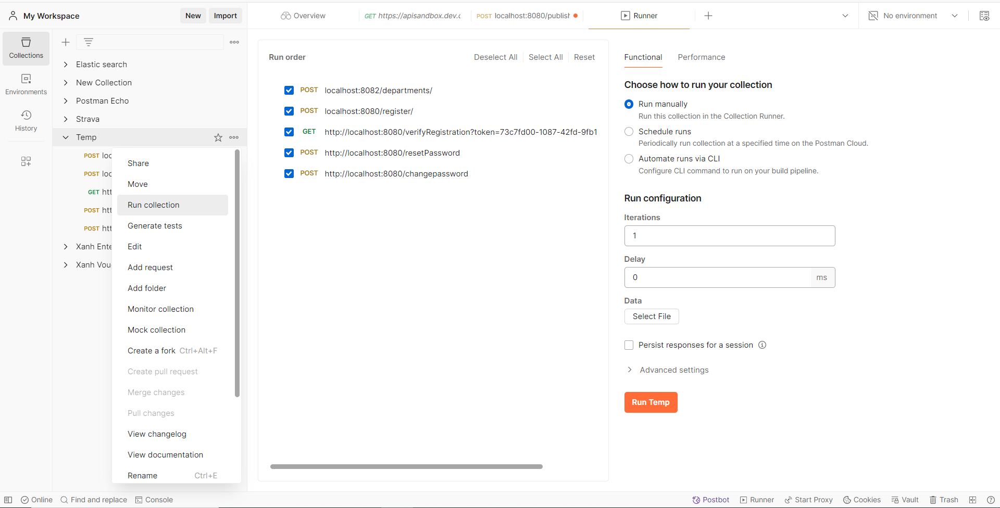
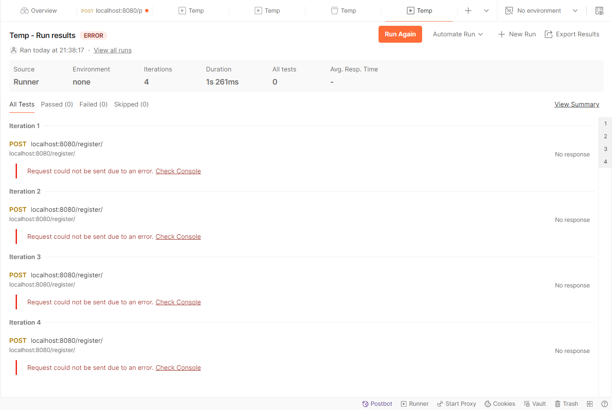

# Kiến thức test nói chung

## Kiểm thử chức năng (Functional Testing)
### Unit Testing (UT)
> Kiểm thử các đơn vị nhỏ nhất của phần mềm (thường là các function/method/screen/batch). Dành cho dev/tester thực hiện trên môi trường local/test/dev(develop)/môi trường dev

Ví dụ:  
Test cases validate input.  
Test API/Controller/Service/Batch theo độ phù C0, C1, C2. 
Test các Batch hoạt động (Before test: Data version1 => After test: Data version 2)

### Integration Testing (IT)
> Kiểm thử sự tương tác giữa các đơn vị đã được kiểm thử riêng lẻ. Dành cho tester thực hiện trên test/dev/môi trường IT

Ví dụ:  
Test việc kết hợp giữa FE vs BE. 
Test việc giao tiếp module đăng ký user vs module gửi mail vs module tạo profile. (Data sử dụng có thể phải chuẩn bị trong sandbox hoặc tạo thủ công) 
Test tính năng xác nhận mail sau khi đăng ký tài khoản

**Các chiến lược kiểm thử IT**
* Big Bang Integration Testing: Tất cả các mô-đun được tích hợp cùng một lúc, sau đó toàn bộ hệ thống được kiểm thử. Ưu điểm: Đơn giản, ít kế hoạch. Nhược điểm: Khó xác định nguồn gốc của lỗi khi xảy ra, khó cô lập và sửa lỗi.

* Incremental Integration Testing: Mô-đun được tích hợp và kiểm thử từng phần một. Ưu điểm: Dễ dàng xác định và sửa lỗi, kiểm soát tốt hơn. Nhược điểm: Tốn thời gian và công sức hơn Big Bang.

* Top-Down Integration Testing: Tích hợp và kiểm thử từ mô-đun cấp cao đến mô-đun cấp thấp. Ưu điểm: Dễ phát hiện các lỗi giao diện ở cấp cao, ưu tiên kiểm thử các chức năng chính.Nhược điểm: Cần sử dụng các stub cho mô-đun chưa phát triển.

* Bottom-Up Integration Testing: Tích hợp và kiểm thử từ mô-đun cấp thấp đến mô-đun cấp cao. Ưu điểm: Dễ phát hiện các lỗi giao diện ở cấp thấp, ưu tiên kiểm thử các chức năng cơ bản. Nhược điểm: Cần sử dụng các driver cho mô-đun cấp cao.

* Sandwich Integration Testing (Hybrid): Kết hợp giữa Top-Down và Bottom-Up, kiểm thử đồng thời từ trên xuống và từ dưới lên.Ưu điểm: Kết hợp ưu điểm của cả hai chiến lược trên, kiểm thử toàn diện. Nhược điểm: Phức tạp, cần nhiều tài nguyên.

### System Testing (ST)
> Kiểm thử toàn bộ hệ thống để đảm bảo hệ thống hoạt động đúng như mong đợi. Dành cho khách hàng và test thực hiện trên môi trường ST/Staging/Môi trường ST (Data, hệ thống sát với production nhất) 

Ví dụ:  
Test việc đăng ký và xác nhận email với email thực (Data/email có thể là thực tế và chứa thông tin thật)

### Acceptance Testing (UAT)
> Kiểm thử để xác định liệu hệ thống có đáp ứng được các yêu cầu và tiêu chuẩn của khách hàng hay không. Dành cho end user thực hiện trên production/go live.
Tester ít khi được thực hiện test ở giai đoạn này. Nếu có bug ở giai đoạn này thường là bug priority cao, critical bug.

## Kiểm thử phi chức năng (Non-Functional Testing)
### Performance Testing
> Kiểm thử hiệu năng của hệ thống khi thực thi với nguồn xử lý lớn đảm bảo thời gian phản hồi quy định, đánh giá độ hiệu quả tính năng và UX. Mục đích để cải thiện logic, tối ưu về memory, thời gian thực hiện

Ví dụ:  
Test thời gian hệ thống xử lý file dung lượng cao, xử lý nhiều data trong batch. => Sau test: Hệ thống xử lý được với n request các file dung lượng lớn.

### Load Testing
> Kiểm thử hệ thống dưới tải trọng cao, nhiều luồng xử lý đồng thời trong thời gian xác định. Để đánh giá với gần giới hạn truy cấp thì hệ thống gặp vấn đề gì nhằm tối ưu luồng, thực thi?

Ví dụ:  
Test nhiều request truy cập đồng thời (chưa đạt ngưỡng) => Sau test: Hệ thống xử lý được với n request đồng thời trong n phút.

### Stress Testing
> Kiểm thử hệ thống dưới điều kiện vượt quá tải trọng về lượt truy cập đồng thời và trong thời gian dài. Để đánh giá ngưỡng có thể hoạt động của hệ thống và đưa ra quyết định về số liệu đó.

Ví dụ: 
Test 1.000 -> 5.000 -> ... -> n request đồng thời vào ứng dụng và xem ở mức độ nào thì hệ thống sẽ không còn hoạt động được.
=> Sau test: dự đoán và ước lượng tài nguyên cần scale up để hệ thống không bị chết.

### Security Testing
> Kiểm thử bảo mật của hệ thống. Để phát hiện và khắc phục các lỗ hỏng nhắm đảm bảo an toàn cho hệ thống và data người dùng.

**Các kỹ thuật kiểm thử bảo mật**
* Static Application Security Testing (SAST): Phân tích mã nguồn của ứng dụng để phát hiện lỗ hổng bảo mật mà không cần chạy ứng dụng.

* Dynamic Application Security Testing (DAST): Kiểm thử ứng dụng đang chạy để phát hiện lỗ hổng bảo mật thông qua tương tác với ứng dụng.

* Interactive Application Security Testing (IAST): Kết hợp giữa SAST và DAST để cung cấp cái nhìn chi tiết và toàn diện hơn về bảo mật ứng dụng.

* Runtime Application Self-Protection (RASP): Tích hợp bảo mật trực tiếp vào ứng dụng để phát hiện và ngăn chặn các cuộc tấn công trong thời gian thực.

**Các công cụ**
> Burp Suite, OWASP ZAP (Zed Attack Proxy), SonarQube

### Usability Testing
> Kiểm thử tính khả dụng của hệ thống. Nhằm đánh giá tính dễ sử dụng, nâng cao UX.

Ví dụ: 
Với các vấn đề này cần kinh nghiệm về UX, góc nhìn và nghiên cứu, góp ý về các vấn đề về workflow, giao diện của hệ thống.

## Kiểm thử hồi quy (Regression Testing)
> Đảm bảo rằng các thay đổi hoặc cập nhật phần mềm không gây ra lỗi mới hoặc tái xuất hiện lỗi cũ

Ví dụ:
Dev fix bug A nhưng bug B bị reopen. Việc B bị reopen là do test hồi quy. Nếu không test hồi quy có thể bị sót bug B.

## Kiểm thử tự động (Automated Testing)
> Sử dụng các công cụ và kịch bản tự động để kiểm thử phần mềm. Nhằm tối ưu thời gian, chi phí các thao tác test với kịch bản lặp lại nhiều lần

Ví dụ: 
Sử dụng selenium, bot, RPA để tự động thực hiện theo kịch bản (Đọc dữ liệu > truy cập trang web > nhập liệu > click button > check kết quả > download file export)

## Phương pháp kiểm thử phần mềm
### Kiếm thử hộp đen
> Kiểm thử dựa trên yêu cầu và chức năng của phần mềm mà không cần biết về mã nguồn.
Thường được sử dụng trong System Testing và Acceptance Testing.

### Kiểm thử hộp trắng
> Kiểm thử dựa trên kiến thức về mã nguồn của phần mềm.
Thường được sử dụng trong Unit Testing.

### Gray Box Testing
> Kết hợp giữa White Box Testing và Black Box Testing.

### Kỹ Thuật Kiểm Thử Biên (Boundary Testing)
> là một kỹ thuật kiểm thử phần mềm nhằm kiểm tra các giá trị giới hạn của dữ liệu đầu vào. 

Các giá trị biên tập trung vào:
* Min
* Max
* Min + 1
* Min - 1
* Max - 1
* Max + 1
* Min < n < Max

### Kỹ Thuật Bảng Quyết Định (Decision Table Testing)
Bảng quyết định là một bảng mà mỗi hàng biểu diễn một kết hợp cụ thể của các điều kiện đầu vào và kết quả tương ứng. Nó giúp đảm bảo rằng tất cả các trường hợp có thể xảy ra được kiểm thử.

Ví dụ: Giả sử một hệ thống kiểm tra đăng nhập với hai điều kiện: username và password:

| Username | Password | Kết quả | 
| ----| ------| ----------| 
| Đúng | Đúng | Thành công | 
| Đúng | Sai | Thất bại | 
| Sai | Đúng | Thất bại | 
| Sai | Sai | Thất bại |

### Kỹ Thuật Kiểm Thử Kết Hợp (Combinatorial Testing)
> Kỹ thuật này giúp đảm bảo rằng tất cả các kết hợp của các yếu tố đầu vào đều được kiểm thử, đặc biệt là khi có nhiều yếu tố ảnh hưởng đến hành vi của hệ thống.

### Kỹ Thuật Kiểm Thử Phân Vùng Tương Đương (Equivalence Partitioning)
> Là chia miền giá trị đầu vào thành các phân vùng tương đương. Một giá trị trong mỗi phân vùng được chọn để kiểm thử, với giả định rằng nếu một giá trị trong phân vùng đó hoạt động đúng, thì tất cả các giá trị khác trong phân vùng đó cũng sẽ hoạt động đúng.

### Kỹ Thuật Kiểm Thử Bảng Trạng Thái (State Transition Testing)
> Kỹ thuật này kiểm thử hành vi của hệ thống dựa trên trạng thái hiện tại và sự kiện đầu vào, đảm bảo rằng hệ thống chuyển đổi đúng từ trạng thái này sang trạng thái khác.

## Công cụ test, chụp evidence
### Công cụ thực hiện phù hợp cho các giai đoạn test
* UT phase: JUnit (Java), Jacoco (Java), NUnit(.NET), TestNG 
* IT phase: Postman, SOAPUI, giao diện, ứng dụng mobile.
* ST, UAT phase: selenium, QTP/UFT
* Performance Testing: JMeter, LoadRunner
* Security Testing: OWASP ZAP, Burp Suite
* Automated Testing trong DevOps: Jenkins, Gitlab CI/CD, Github Action

## Các note khác
* Free test: tự do test không theo testcase
* Smoke test: là test sơ bộ các tính năng trong sprint, bug, phase sau quá trình build/deploy
* Monkey test: là test ngẫu nhiên, không theo kịch bản thông thường, có thể bao gồm cả kịch bản phá huỷ hệ thống, cố tình tìm ngoại lệ trong hệ thống.

# Kinh nghiệm test dự án outsource

## Quy trình trong dự án outsource Japan
1. KH định nghĩa yêu cầu trong sprint/phase/anken (sprint1, phase1, anken tháng 3,...) - Mỗi sprint/phase/anken thực hiện nhiệm vụ & tính năng cụ thể.
Ví dụ: sprint/phase/anken thực hiện design + code + test UT + test IT cho tính năng/API/screen A, B, C
2. Dev tạo Design detail (DD) và KH chốt DD
3. Dev triển khai code -> Done -> review + confirm version (Lead or KH review)
4. Test triển khai testcase -> Done -> review + confirm
5. Thực hiện testing với version code và testcase đã chốt
6. Capture evidence + trình bày & focus vào nội dung theo test case
7. Nếu phát hiện bug thì report bug (Redmine, Backlog, Jira) > Thông báo cho dev để fix > Dev fix xong chuyển trạng thái bug > Test verify bug > Recapture evidence & trình bày evidence
8. Close testcase, evidence gửi khách hàng review + fix theo comment khách hàng.

## Dự án test batch

### Bài toán kiểm tra theo thiết kế
**Cần xác định phạm vi**
> Base vào thiết kế và QA. Những thay đổi thường được phản ảnh trong sheet history, nội dung bôi màu nổi bật (cần confirm lại)

Nội dung chỉnh sửa/thêm mới logic sẽ phải test case như nào?
Các file input/output thay đổi như nào?
Các check các case degrade, check các case bình thường, case đặc biệt (như case 10k record, case chạy bình thường không liên quan đến phần chỉnh sửa)

**Xác định testcase**
> Dựa vào phạm vi và các kiến thực testing (bảng quyết định, biên, phân vùng,...)

Xác định đồ coverage (phủ hết thiết kế)?
Xác định các trường hợp đặc biệt (ký tự tiếng nhật, tiếng việt, wildcard, html text, sql injection)?

**Thực hiện tạo data**
> Base vào testcase và kiến thực code

Quy trình: tạo 1 case chạy đúng > duplicate case đúng ra và thay đổi phù hợp với testcase
-> Lưu lại data bằng raw data table trong excel hoặc câu lệch sql

**Thực hiện test**
> Base theo testcase và data test

Đánh giá xem có phải chạy từng case hay chạy nhiều case 1 lúc?

Thao tác
* Thực hiện lưu evidence trước khi test
* Capture các evidence khi thực hiện
* Thực hiện lưu evidence kết quả sau test
* Trình bày evidence & data trước, sau. Focus vào sự khác việc để chứng mình thao tác + kết quả theo test case

**Thực hiện self check + review**
> Gửi review và base theo thiết kế. Nếu có bug, sai sót thì gửi để check lại thao tác test or bug code.

### Bài toán cần show giá trị chính xác phần code thay đổi
**Bối cảnh**
Bổ sung thiết kế bổ sung thêm update n field trong tính năng A. 
Flow tính năng A:
Ban đầu: Đọc từ table + file được record trạng thái 0.0 > update record theo điều kiện thành 0.2 > kết thúc
Sau sửa: Đọc từ table + file được record trạng thái 0.0 > update record theo điều kiện thành trạng thái 0.1 > update record theo điều kiện thành 0.2 > kết thúc (Field status-0.0 = 1 -> status-0.1 = 2 -> status-0.2 = 3)

**Vấn đề**
Kết quả data trước và sau không thể phản ảnh giá trị status-0.1 = 2 trong quá trình? 
Câu hỏi: Tại sao lại thế được? Trả lời: Lần update 1 thực hiện với cột a, b, status. Lần update 2 thực hiện với cột c, d, e, f, status. Chả may dev có thể update hết các cột a, b thì DB sau sẽ check được nhưng dev có thể sót status. 

**Giải pháp**
Thực hiện test debug. Đặt debug vào dòng thay đổi or kết thúc update lần 1 và capture evidence chứng minh giá tri đúng.

### Bài toán cần lượng data test lớn (1000, 2000, n)
**Bối cảnh**
Với các công nghệ cần phải test + số lượng data & chất lượng theo test case

**Giải pháp**
* Tạo trên giao diện: phù thuộc vào từng hệ thống
* Tạo sql. Với mỗi loại csdl thì đều có câu lệch có thể tạo nhiều record với sự khác nhau về id và tên chưa id tăng dần

### Bài toán test performance đơn giản
**Bổi cảnh**
Cần test/tái hiện việc gọi api nhiều lần liên tục để phát hiện ra vấn đề với đa luồng/threads

**Giải pháp**
Thực hiện sử dụng Run Collection postman

* Thực hiện add các api theo collection và click run collection

* Tick chọn các api + điền iterations & delay time > Click Run Temp
